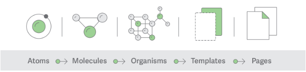

# **아토믹 디자인 (atomic design)**

## 설명

사용법

### 🍅 Atom(원자)

- #Generic #Abstract
- 원자은 진짜 말그대로 가장 작은 단위의 컴포넌트이다.
- 원자는 어떠한 context가 주어지든지 이에 해당하는 컴포넌트가 생성될 수 있어야 한다.
- 때문에 다양한 state를 다양하게 가지고 있어야하며 추상적이지만 최대한 포용할 수 있게 되어야 설계 되어야 한다. Ex) button: disabled, hover, different sizes, etc.
- **원자는 마진이나 위치 값을 가지고 있지 않는다.**

### 🥫 Molecule(분자)

- #LittleComplex
- 원자를 엮어 조금 복잡한 단위의 분자가 생성된다.
- 분자는 분자만의 프로퍼티를 가지고 있을 수 있고 이를 활용해 원자에 기능을 만들어 줄 수도 있다.
- **분자가 원자의 위치 값을 지정하기도 한다.**

### 🍝 Organism(유기체)

- #MoreComplex
- 유기체는 분자를 엮어 만들어서 생성되고 **때로는 분자가 되지 않은 원자가 엮이기도 한다**.
- 유기체가 완성되면 컴포넌트가 최종 모습을 가지게 된다.
- **하지만 여전히 contents에 따라 최대한 재사용성 높게 개발하는 것이 중요하다!**
- **유기체는 분자와 원자의 위치 값을 조정한다!**

### 📄 Template(템플릿)

- #Layout #NoStyling
- 템플릿은 만들어진 유기체와 컴포넌트의 **positions, placements**을 정해주는 역할을 한다.
- 단, 템플릿에는 Styling이나 Color는 들어가지 않는다.
- **템플릿의 역할은 페이지의 그리드를 정해주는 역할 뿐이다.**

### 🍱 Page(페이지)

- #Final
- 페이지는 템플릿을 이용해서 각 그리드에 컴포넌트를 그려서 디스플레이한다.

장점

- 리액트를 사용한다면 [스토리북](https://storybook.js.org/)을 함께 적용하게 되면 더 큰 효과를 나을 수 있다.
- 초기 개발 시간이 길지 모르기만 작은 단위의 Component를 잘 설계해놓으면 중장기적으로 개발 기간을 단축할 수 있다 😎

**참고링크**

[카카오에서 사용하는 아토믹 디자인](https://fe-developers.kakaoent.com/2022/220505-how-page-part-use-atomic-design-system/)

https://ghost4551.tistory.com/255

https://ui.toast.com/weekly-pick/ko_20200213

https://mulder21c.io/comment-for-using-atomic-design-and-storybook/
