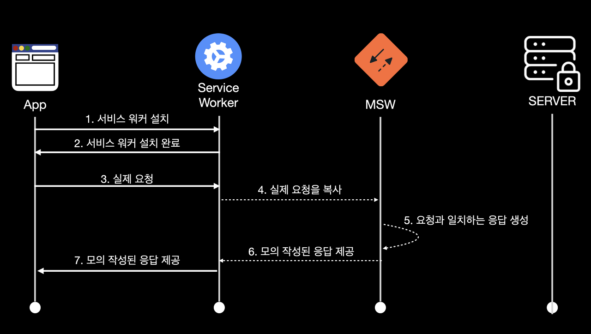

## MSW (Mocking Service Worker)

**MSW란?** 

MSW (Mock Service Worker)은 프론트엔드 개발 시에 가상의 서비스 워커를 활용하여 백엔드와의 데이터 통신을 대신하는 도구입니다. 기존에는 브라우저와 데이터를 주고받는 역할을 백엔드가 담당하였지만, **MSW를 사용하면 프론트엔드에서 가상의 서비스 워커**를 통해 **데이터 통신**을 처리할 수 있습니다.

<p align="center">
    
</p>

일반적으로 프론트엔드와 백엔드 간의 통신은 **브라우저가 백엔드에 요청**을 보내고, **백엔드**는 그에 대한 **응답을 반환**하는 방식으로 이루어집니다. 하지만 MSW를 사용하면 프론트엔드 개발자는 가상의 서비스 워커를 통해 **백엔드와의 통신을 시뮬레이션**할 수 있습니다. 이렇게 가상의 서비스 워커를 활용하면 실제 **백엔드 서비스 없이도 프론트엔드 개발을 진행할 수 있으며**, 미리 정의한 모의 데이터를 활용하여 테스트 및 개발을 수행할 수 있습니다.

**기대효과**
1. 백엔드 API가 구현이 되기 이전에 미리 API가 실제로 오는 것처럼 구현이 가능합니다.

2. 값이 지불이 되는 API를 사용하지 않고 미리 만들어둔 Mock 데이터를 통해 실제로 응답을 받는 것처럼 사용할 수 있습니다.


**MSW 사용하는 방법**

1. msw를 설치합니다.
    
    ```jsx
    $ npm install msw --save-dev
    # or
    $ yarn add msw --dev
    ```
    
2. msw 설정 템플릿 파일을 public에 추가합니다.
    
    ```jsx
    $ npx msw init public
    ```
    
3. worker에 등록할 handler들을 등록합니다.

    ```typescript
    const restHandler = rest.get("요청할 url", (req, res, ctx) => {
            return res(ctx.status("status 값"), ctx.json("미리 만들어둔 객체"));
        }
    )
    ```
    status 값은 다음과 같이 작성합니다.    
    ex : 성공: 200, 잘못된 요청: 404

    [참고자료](https://www.whatap.io/ko/blog/40/)


3. 작성해둔 handler들을 가지고 worker를 설치해줍니다.

    ```typescript
    import {rest, SetupWorker, setupWorker} from 'msw';

    export const worker = setupWorker(restHandler);
    ```

    ```typescript
    // handler.ts

    export const worker: SetupWorker = setupWorker(...[
        rest.get('/api/todo', async (_, res, ctx) => {
            return res(ctx.status(200), ctx.json(todoMock));
        }),
        rest.post('/api/todo', async (req, res, ctx) => {
            let title = "";
            let content = "";
            await req.json().then((data) => {
                title = data.title
                content = data.content
            })
            return res(ctx.status(200), ctx.json({
                id: Math.floor(Math.random() * 10000000),
                title,
                content,
                state: false
            }));
        }),
    ]);
    ```

5. 사용하는 가장 상위 컴포넌트에서 실행(동작)해주면 됩니다.
    
    ```typescript
    // App.ts
    
    import { worker } from '__mock__/handler'
    
    function App() {
    	if(process.env.NODE_ENV === 'development') {
    		worker.start()
    	}
    	
    	return (
    		<Provider store={store}>
    			<ThemeProvider theme={theme}>
    				<GlobalStyles />
    				<RouterProvider router={router} />
    			</ThemeProvider>
    		</Provider>
    	)
    }
    ```