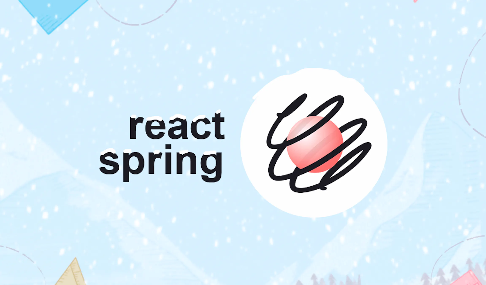

## React Spring

<p align="center">
    
</p>


### React Spring이란?

```Plaintext
UI와 상호작용하여 앱에 생명을 불어 넣어주는 라이브러리입니다.
```

react-spring은 리액트 애플리케이션에서 애니메이션을 관리하기 위한 라이브러리입니다. 이 라이브러리는 애니메이션을 시간과 곡선의 관점에서 다루는 대신, 스프링 시스템을 기반으로 애니메이션을 처리합니다.

스프링은 자연스러운 운동을 시뮬레이션하기 위한 수학적인 모델로 이루어져있습니다.. 스프링은 물리적인 시스템에서 발생하는 운동의 특성을 모방하여, 애니메이션 요소를 부드럽고 자연스럽게 움직이도록 도와줍니다. 스프링은 정의된 곡선이나 설정된 지속 시간 없이, 자연스러운 운동을 구현할 수 있게 해줍니다.

따라서, react-spring은 애니메이션을 자연스럽게 움직이게 만들기 위해 스프링 시스템을 활용하는 라이브러리라고 할 수 있습니다.

### 특징

1. web에 국한되지 않고 여러 환경에서 사용할 수 있습니다. React-Native와 같은 다양한 환경에서 사용할 수 있습니다.
    - web
    - native
    - three
    - konva
    - zdog  
<br>
2. 불필요한 오버헤드를 방지할 수 있습니다.

    애니메이션이 실행될 때마다. 불필요한 렌더링을 방지할 수 있습니다. 상태를 업데이트 하지않고 부드럽고 유동적인 애니메이션을 사용할 수 있습니다.
<br>
3. SSR을 지원합니다.

    useRef, useEffect를 사용하지 않고도 애니메이션 내에서 처리가 가능합니다.

### 설치 방법
```cmd
# npm
$ npm i @react-spring/web
or
# yarn
$ yarn add @react-spring/web
```

### 사용 방법
애니메이션을 사용하는데에 있어서 처리하는 요소들은 ``animated`` 컴포넌트입니다. 해당 요소는 단지 HOC Component 일 뿐입니다.

1. Object를 반환을 받았을 경우

    ````typescript
    import { useSpring, animated } from '@react-spring/web'

    export default function MyComponent() {
    const springs = useSpring({
        from: { x: 0 },
        to: { x: 100 },
    })

    return (
        <animated.div
        style={{
            width: 80,
            height: 80,
            background: '#ff6d6d',
            borderRadius: 8,
            ...springs,
        }}
        />
    )
    }
    ````

    useSpring을 통해서 animaition의 시작 정보(from)과 끝 정보(to)를 animated에 전달을 해주고 있습니다. 덕분에 만들어진 ``springs`` config 정보를 이용하여 animated.div에 전달을 해줌으로써 해당 컴포넌트가 정상적으로 움직일 수 있습니다.


2. 배열을 반환을 받았을 경우

    ```typescript
    "use client"

    import {useSpring, animated} from '@react-spring/web'

    export default function Page() {
        const [springs, api] = useSpring(() => ({
            from: {x: 0},
        }))

        const handleClick = () => {
            api.start({
                from: {
                    x: 0,
                },
                to: {
                    x: 300,
                },
                loop: true
            })
        }

        return (
            <div>
                <animated.div
                    style={{
                        width: 80,
                        height: 80,
                        background: '#ff6d6d',
                        borderRadius: 8,
                        ...springs,
                    }}
                />
                <nav className={"flex gap-2"}>
                    <button onClick={()=>api.stop())}>stop</button>
                    <button onClick={handleClick}>start</button>
                    <button onClick={()=>api.pause())}>pause</button>
                    <button onClick={()=>api.resume())}>resume</button>
                </nav>
            </div>
        )
    }
    ```

    해당 배열의 첫 번째 인자로는 (1)과 같은 animation의 정보를 담고있는 config 파일이 존재합니다. 추가로 Controller 값이 전달이 되는데 이를 통해 우리는 animation을 조종할 수도 있습니다.

**api 메소드 목록**

>start: 애니메이션을 시작합니다. start 메서드에는 애니메이션 구성을 전달하여 애니메이션을 설정할 수 있습니다.
>
>stop: 애니메이션을 중지합니다. 현재 애니메이션 상태에서 중지하며, 중지한 상태에서 다시 시작하면 중단된 지점부터 애니메이션이 재개됩니다.
>
>pause: 애니메이션을 일시 중지합니다. 정지된 상태에서 다시 시작하면 중단된 지점부터 애니메이션이 재개됩니다.
>
>resume: 일시 중지된 애니메이션을 다시 시작합니다. 중단된 지점부터 애니메이션이 재개됩니다.
>
>set: 애니메이션의 속성을 직접 설정합니다. 예를 들어, api.set({ opacity: 0 })와 같이 사용하여 애니메이션의 특정 속성을 변경할 수 있습니다.

**스타일을 적용하는 방법**

react-spring은 다로 스타일이 정의된 것이 없습니다. 때문에 기본적으로 css module과 tailwind를 classNam 속성을 통해 적용할 수 있습니다. 만약 css-in-js 기술을 사용하고 싶다면 `styled()` 함수를 사용하면 사용이 가능합니다.

```typescript
import { styled } from '@stitches/react'

const MyModal = styled(animated.div, {
width: '40vw',
height: '20vh',
borderRadius: '8px',
backgroundColor: '$white80',
})
```

### 상황에 따라 사용할 수 있는 제공되는 훅들
<br>
- useSpring: 단일 데이터를 특정 위치나 스타일로 이동시키는 애니메이션을 생성합니다. 예를 들어, 요소를 한 위치에서 다른 위치로 부드럽게 이동시키는 효과를 구현할 수 있습니다.

- useSprings: 여러 개의 애니메이션을 동시에 적용하는데 사용됩니다. 일반적으로 배열 형태로 여러 데이터를 받아 각각의 데이터에 대한 애니메이션을 생성합니다.

- useTrail: 단일 데이터 집합에 대한 여러 개의 애니메이션을 순차적으로 적용하는데 사용됩니다. 하나의 애니메이션에 다른 애니메이션이 따라가는 효과를 구현할 수 있습니다.
    ```typescript
    import { useTrail, animated } from '@react-spring/web';

    function MyComponent() {
    const items = ['항목 1', '항목 2', '항목 3'];

    // useTrail 훅을 사용하여 items 배열의 요소들에 대한 애니메이션 설정
    const trail = useTrail(items.length, {
        from: { opacity: 0, transform: 'translateY(20px)' },
        to: { opacity: 1, transform: 'translateY(0)' },
        config: { tension: 200, friction: 20 },
    });

    return (
        <div>
        {trail.map((style, index) => (
            <animated.div key={index} style={style}>
            <p>{items[index]}</p>
            </animated.div>
        ))}
        </div>
    );
    }
    ```

- useTransition: 요소의 등장과 사라짐을 처리하기 위해 사용됩니다. 트랜지션의 마운트와 언마운트를 관리하여 요소의 등장과 사라짐을 부드럽게 처리할 수 있습니다.
    ```typescript
    import { useState } from 'react';
    import { useTransition, animated } from '@react-spring/web';

    function MyComponent() {
    const [items, setItems] = useState([]);

    // useTransition 훅을 사용하여 items 배열의 요소들에 대한 애니메이션 설정
    const transitions = useTransition(items, {
        from: { opacity: 0, height: 0 },
        enter: { opacity: 1, height: 'auto' },
        leave: { opacity: 0, height: 0 },
        config: { tension: 200, friction: 20 },
    });

    // 새로운 요소 추가
    const addItem = () => {
        setItems((prevItems) => [...prevItems, { id: Date.now(), text: '새로운 항목' }]);
    };

    // 요소 제거
    const removeItem = (id) => {
        setItems((prevItems) => prevItems.filter((item) => item.id !== id));
    };

    return (
        <>
        <button onClick={addItem}>항목 추가</button>
        {transitions((style, item) => (
            <animated.div style={style} key={item.id}>
            <p>{item.text}</p>
            <button onClick={() => removeItem(item.id)}>삭제</button>
            </animated.div>
        ))}
        </>
    );
    }
    ```

- useChain: 여러 개의 애니메이션을 순차적으로 또는 중첩하여 적용하기 위해 사용됩니다. 애니메이션들을 연결하여 실행 순서를 정의할 수 있습니다.
    
    ```typescript
    import {useSpring, animated, useChain, SpringRef} from '@react-spring/web';

    export default function MyComponent() {
        // 애니메이션에 사용할 스타일 객체들
        const spring1 = useSpring({opacity: 1, from: {opacity: 0}});
        const spring2 = useSpring({x: 200, from: {x: 0}});
        const spring3 = useSpring({scale: 1.5, from: {scale: 1}});

        // 애니메이션의 실행 순서를 정의하는 배열
        const animations = [spring1, spring2, spring3] as SpringRef[];

        // useChain 훅을 사용하여 애니메이션들을 순차적으로 실행
        useChain(animations);

        return (
            <>
                <animated.div style={spring1}>첫 번째 애니메이션</animated.div>
                <animated.div style={spring2}>두 번째 애니메이션</animated.div>
                <animated.div style={spring3}>세 번째 애니메이션</animated.div>
            </>
        );
    }
    ```


- useSpringValue : 애니메이션 값을 생성하고 조작할 수 있습니다. 이 값은 일반적으로 animated 컴포넌트와 함께 사용되어 애니메이션 효과를 부여하는 데 사용됩니다.

    ```typescript
    import { useSpringValue, animated } from '@react-spring/web';

    function MyComponent() {
    const opacity = useSpringValue(0); // 초기 투명도 값을 0으로 설정

    // 버튼 클릭 시 투명도 애니메이션 실행
    const handleClick = () => {
        opacity.set(1); // 투명도 값을 1로 설정하여 애니메이션 실행
    };

    return (
        <>
        <animated.div
            style={{
            opacity: opacity, // 애니메이션 값을 스타일에 적용
            }}
        >
            // 애니메이션 효과를 가진 요소
        </animated.div>
        <button onClick={handleClick}>애니메이션 시작</button>
        </>
    );
    }

```