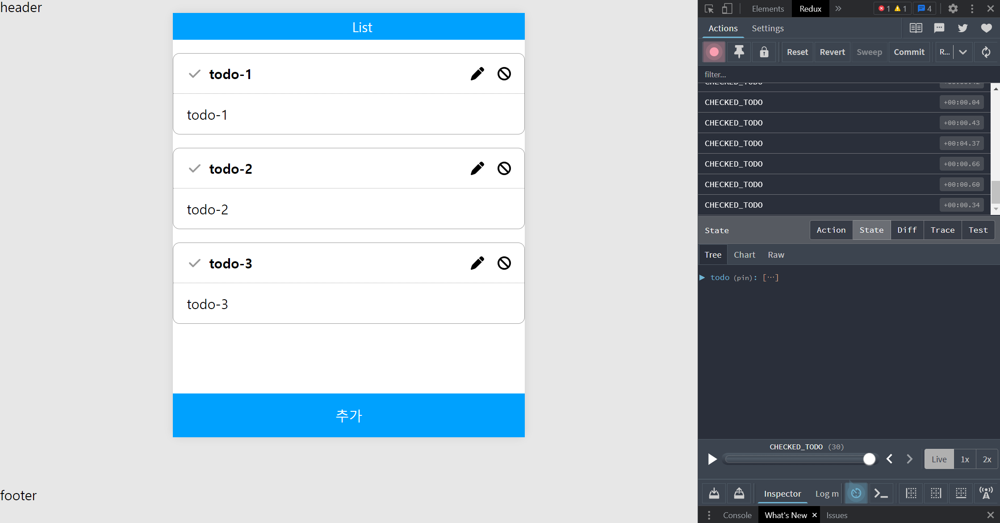

# 리덕스

**리덕스를 사용하기에 앞서 리듀서에 대해서 알아야할 필요가 있습니다.**

- 리덕스는 리듀서들을 직접 관리하는 것이 아니라, 단일 스토어(store)에서 상태를 관리하는 라이브러리입니다. 리듀서는 리덕스에서 상태 변경을 처리하는 함수입니다.

리듀서는 Flux 패턴을 이용한 상태변경을 할 수 있는 로직을 정리해둔 함수로서, 재사용을 할 수 있고 순수 함수의 개념으로 구성이 되어져 있습니다.

MVC 패턴은 Model, View, Controller로 구성되며, 리덕스는 Flux 아키텍처의 한 구현체입니다. MVC와 Flux는 다른 개념이며, 리덕스는 Flux 패턴을 따르고 있습니다.

페이스북 meta팀에서 만든 Flux 패턴은 이런 View가 다양한 상호작용을 하지못하게 단방향으로 데이터를 받아와 처리해 데이터를 수정해주는 역할을 해주었고 이에 단방향으로 데이터가 흘러가다보니 보다 쉽게 데이터의 추적이 쉬워지고 유지보수를 할때에도 해당 로직만을 수정하면 됨으로서 관리가 쉬워졌습니다.

하지만 리듀서와 context만을 사용하여 전역변수를 관리하면 해당 리듀서(전역변수)가 많아질때마다 컴포넌트들에게 provider를 하나씩 감싸주어야 하고 이는 코드의 가독성을 줄이고 데이터들의 연산에 있어서 많은 시간과 값이 요구될 수 있습니다.

**리덕스란?**

1. useReducer와 useContext를 기반으로 만들어 전역 상태 관리 라이브러리
2. 중앙 집중적인 상태 관리

   단일 스토어에서 리듀서들을 관리합니다. 이는 일관되게 관리를 하기 쉽게하고 provider를 하나만 생성함으로서 전역 변수들을 관리할 수 있게 해줍니다.

3. 다양한 미들웨어를 통한 확장성

   개발자 도구(F12 ⇒ prev, action, next 값들을 받아와서 확인이 가능합니다. , logger 등을 지원합니다.

**단점**

1. 리덕스는 준비를 하는데에 있어서 준비할 보일러 코드(준비작업)들이 필요합니다.
2. 큰 규모의 프로젝트일수록 많은 수의 리듀서가 필요로 합니다. 여러 개의 리듀서를 조합하는 작업은 성능을 저하시킬 수 있습니다.

**사용방법**

1. 리덕스(Redux) 설치하기

   ```jsx
   $npm i redux react-redux
   // 리덕스는 react만을 위해서 만들어진 라이브러리가 아니기 때문에 따로 react용 redux를 설치
   // 해야합니다.
   ```

2. 전역변수를 전달해주기 위해서 provider을 생성해줍니다.

   ```jsx
   // App.js

   import { Provider } from 'react-redux';
   function App() {
     return (
       <Provider>
         <User />
       </Provider>
     );
   }
   ```

3. reducer 들을 관리하기 위해서 store 파일을 미리 생성줍니다.

   ```jsx
   // store/store.js

   import { createStore } from 'redux';
   import { rootReducer } from '../reducer/index';

   const reduxConfig = () => {
     const store = createStore();
     return store;
   };

   export default reduxConfig;
   ```

4. store 파일에 reducer들을 전달하기위해서 reducer들의 통합 rootReducer를 만들어줍니다.

   ```jsx
   //reducer/index.js

   export const rootReducer = combineReducers({ user, product, consumer });
   ```

   combineReducers안에 들어가는 reducer들은 기존의 reducer 로직과 동일합니다.

   ```jsx
   //reducer/user.js

   const initialState = [
     {
       id: 1,
       name: '김성용',
     },
   ];

   const reducer = (state = initialState, action) => {
     switch (action.type) {
       case 'ADD_USER':
         const { newId, newName, newState } = action.payload;
         const newUser = {
           id: newId,
           name: newName,
           state: newState,
         };
         return [...state, newUser];
       case 'DELETE_USER':
         return state.filter((state) => state.id !== action.id);
       default:
         return state;
     }
   };

   export default reducer;
   ```

5. 만들어진 rootReducer를 store파일에 전달을 해줍니다

   ```jsx
   //store/store.js

   const reduxConfig = () => {
     const store = createStore(rootReducer);
     return store;
   };

   export default reduxConfig;
   ```

   - 왜 함수형으로 만들었는지 생각을 해봅니다

6. provider의 전달할 store로 reducer파일들이 모여져서 관리되는 rootReducer를 store로 만들어서 전달해줍니다.

   ```
   // App.js

   function App() {

       const store = reduxConfig();
       return (
           <Provider store={store}>
               <User />
           </Provider>
       );
   }
   ```

7. 사용하기 위해선 사용하고자 하는 컴포넌트에서 사용할 값과 dispatch 함수를 가져와 줄 필요가 있습니다.

   ```jsx
   const userList = useSelector((state) => state.user);
   const dispatch = useDispatch();

   const AddHandling = () => {
     dispatch({
       type: 'ADD_USER',
       payload: {
         newId: Math.floor(Math.random() * 10000),
         newName: name,
         newState: !state,
       },
     });
   };
   ```

   - 추가 기능
     **Redux DevTools**

     ```jsx
     $npm install redux-devtools-extension
     ```

     [Redux DevTools](https://chrome.google.com/webstore/detail/redux-devtools/lmhkpmbekcpmknklioeibfkpmmfibljd?hl=ko)
     
     과거를 볼 수 있는 history 기능이나, store내부의 state 상태들의 값들을 개발자도구로 알기쉽게 나타내 줍니다.
     **Redux-actions**
     기존의 reducer에서 사용하는 switch/case문이 아닌 handleActions라는 함수를 사용하여 각 액션마다 업데이트를 하는 함수를 설정하는 형식을 사용할 수 있습니다.

     1. 설치

        ```jsx
        nam install redux-actions
        ```

     2. 적용방법

        ```jsx
        import { createAction } from 'redux-actions';

        const INSERT = 'todos/INCREASE';
        const TOGGLE = 'todos/DECREASE';
        const CHANGE_INPUT = 'todos/CHANGE_INPUT';
        const REMOVE = 'todos/REMOVE';

        export const insert = createAction(INSERT);
        export const toggle = createAction(TOGGLE);
        export const change_input = createAction(CHANGE_INPUT);
        export const remove = createAction(REMOVE);
        ```

        createAction을 사용하면 매번 객체를 직접 만들어 줄 필요 없이 더욱 간결하게 액션 생성 함수를 선언할 수 있습니다.

        ```jsx
        import { createAction, **handleActions** } from 'redux-actions';

        const INSERT = 'todos/INCREASE';
        const TOGGLE = 'todos/DECREASE';
        const CHANGE_INPUT = 'todos/CHANGE_INPUT';
        const REMOVE = 'todos/REMOVE';

        export const insert = createAction(INSERT);
        export const toggle = createAction(TOGGLE);
        export const change_input = createAction(CHANGE_INPUT);
        export const remove = createAction(REMOVE);

        export const changeInput = createAction(CHANGE_INPUT, input => input)

        let id = 3; // insert가 호출될 때마다 1씩 더해집니다.
        export const insert = createAction(INSERT, text => ({
        	id: id++,
        	text,
        	done: false,
        })
        export const toggle = createAction(TOGGLE, id => id)
        export const remove = createAction(REMOVE, id => id)
        ```

        handleActions 함수를 이용해서 reducer 내의 로직을 더욱 간결하게 만들 수 있습니다. 첫 번째 파라미터에는 각 액션에 대한 업데이트 함수를 넣어주고 두 번째 파라미터에는 초기 상태를 넣어줍니다.

        ```jsx
        import { createAction, **handleActions** } from 'redux-actions';

        const todos = handleActions(
        	{
        		[CHANGE_INPUT] : (state, action) => ({ ...state, input: action, payload})],
        		[INSERT] : (state, action) => ({
        			...state,
        			todos: state.todos.concat(action.payload);
        		}),
        		[TOGGLE] : (state, action) => ({
        			...state,
        			todos: state.todos.map(todo =>
        			 todo.id === action.payload ? {...todom done: !todo.done } : todo,
        			),
        		}),
        		[REMOVE] : (state, action) => ({
        			...state,
        			todos: stat.todos.filter(todo => todo.id !== action.id),
        		})
        	},
        	initalState,
        );

        export default todos;
        ```

        **?질문**

        왜 굳이 action에 payload를 써야하는 것일까?.. action.name으로 데이터를 가져오면 안되는 것일까? 흠..

        ⇒ action에 payload를 사용하는 이유는 가져오는 데이터들이 여러개일때 일관성 있게 payload라는 객체안에 담아서 가져올 수 있기 때문이다. payload를 사용하지 않아도 되지만 관리해야하는 데이터들이 많아진다면 상태를 관리하는데에 있어서 복잡해 질 수 있다.

        또한 payload를 사용하기 때문에 action으로 넘겨진 값이라는걸 reducer 로직에서 상태 추적에 있어서 더욱 쉽게 확인 할 수 있다.

        ```jsx
        (...)

        const todos = handleActions(
        	{
        		[CHANGE_INPUT] : (state, { payload: input }) => ({ ...state, input}),
        		[INSERT] : (state, payload : todo) => ({
        			...state,
        			todos: state.todos.concat(todo),
        		}),
        		[TOGGLE] : (state, {payload: id}) => ({
        			...state,
        			todos: state.todos.map(todo =>
        			 todo.id === id ? {...todom done: !todo.done } : todo,
        			),
        		}),
        		[REMOVE] : (state, { payload: id }) => ({
        			...state,
        			todos: stat.todos.filter(todo => todo.id !== id),
        		})
        	},
        	initalState,
        );

        export default todos;
        ```

        리덕스 상태 조회하기

        ```jsx
        import { useSelector } from 'react-redux';

        const CounterContainer = () => {
          const number = useSelector((state) => state.counter.number);
          return <Counter number={number} />;
        };

        export default CounterContainer;
        ```

        useDispatch를 사용하여 액션 디스패치하기

        ```jsx
        import { useSelector, useDispatch } from 'react-redux';

        const CounterContainer = () => {
          const number = useSelector((state) => state.counter.number);
          const dispatch = useDispatch();

          return (
            <Counter
              number={number}
              onIncrease={() => dispatch(increase())}
              onDdcrease={() => dispatch(decrease())}
            />
          );
        };

        export default CounterContainer;
        ```

        컴포넌트 최적화하기

        ```jsx
        import { useSelector, useDispatch } from 'react-redux';

        const CounterContainer = () => {
          const number = useSelector((state) => state.counter.number);
          const dispatch = useDispatch();
          const onIncrease = useCallback(() => dispatch(increase()), [dispatch]);
          const onDecrease = useCallback(() => dispatch(Decrease()), [dispatch]);

          return <Counter number={number} onIncrease={onIncrese} onDecrease={onDecrease} />;
        };

        export default CounterContainer;
        ```
