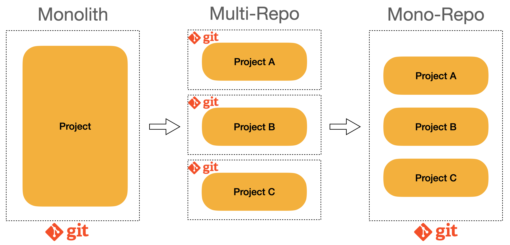

## MonoRepo

### MonoRepo란?

    

[사진출처](https://engineering.linecorp.com/ko/blog/monorepo-with-turborepo)

여러개의 `project`들을 하나의 `repo`에서 작업을 한다는 것은 다른 `repo`에 의존하지 않은 상태로 독립적으로 개발을 한다는 것을 의미합니다. 해당 `repo`를 `mono-repo`라고 말을 합니다. 반대로 기존에 프로젝트 하나에 `repo`가 하나씩 만들어지면 해당 `repo`를 `multi-repo`라고 합니다.

### Multi Repo의 특징

1. 하나의 `repo`에 하나의 `project`만 있습니다.

2. `repo`끼리의 의존성이 없습니다.

### Mono Repo의 특징

1. 여러 `project`들을 하나의 폴더에서 관리합니다.

2. 최상위 `package`의 설정을 따라갑니다. 만약 `lint`나 `prettier`와 같이 `formatter`를 정해두었다면 하위 `package`들에서 따로 설정을 하지 않았더라도 자동으로 적용이 되게됩니다. 이를 통해 `repo`끼리의 의존성이 생기게 됩니다.

> ### Mono Repo 굳이 사용해야 될까?
>
> `mono-repo`가 나중에 나온 방식이라고 해서 `mono-repo`를 사용하자고 하는 것이 아닙니다. `multi-repo`를 사용하면 얻는 이점이 무엇이고 `mono-repo`를 사용했을 때의 이점을 무엇이며 어느 상황에서 사용해야 할 지 알아야합니다.

### Multi Repo의 장점

1. 하나의 `repo`의 하나의 `project`만 있으니 코드가 깨질 가능성이 없습니다. 여러 `repo`간의 작업으로 인해 코드가 깨지거나 이미 운영중인 서비스가 멈추는 불상사가 일어나지 않습니다.

2. 형상관리, CI 속도가 빠릅니다. 여러 `project`가 아닌 하나의 `project`를 관리한다는 것은 말만 들었을 때 부터 코드의 수가 차이가 나는 것을 알 수 있습니다. 이처럼 코드의 양이 적기 때문에 빌드와 같은 훅을 기반으로 하는 도구들의 속도가 빨라집니다.

> 하지만 빠르게 성장하는 수의 팀일수록 프로젝트의 수가 기하급수적으로 늘어나면서 여러 문제들이 발생하기 시작합니다.

### Multi Repo의 단점

1. 코드 컨벤션을 통일하기가 어려워집니다. 물론 `lint`나 `prettier`와 같이 초기 세팅을 해두면 동일하게 적용을 할 수 있습니다. 하지만 매번 설정을 해야하는 번거로움이 있습니다.

2. 각 `project` 별로 사용하는 라이브러리, `module`의 버젼(`stack`)이 달라질 수 있습니다.

3. 다른 `project`의 코드의 재사용을 하지 못하므로 `project`간의 중복되는 코드들이 발생 할 수 있습니다.

4. 만약 여러 팀원들간 작업중이라면 다른 사람의 `repo`를 들어가서 코드를 확인해야하는 번거로움이 있습니다.

> 소규모 단위의 팀과 프로젝트라면 `multi-repo`방식보다 좋은 방식은 없습니다. 하지만 `project`의 규모가 커지고 관리해야 하는 `repo`들이 많아질수록 `mono-repo`를 생각하게 됩니다.

### Mono Repo의 장점

1. 코드의 공유와 재사용성이 유용합니다. `lint`나 `prettier`와 같은 세팅 설정도 초기에 한번만 해주면 모든 `repo`에서 사용이 가능합니다.

2. 통합된 버전으로 모든 서비스가 관리가 가능합니다.

3. 하나의 `repo`에서 의존하기 때문에 의존성 관리가 쉽습니다.

4. 여러 프로젝트 간의 협업이 쉽습니다. 하나의 `repo`에서 작업을 진행하기 때문에 다른 `project`의 코드리뷰와 같이 도움을 줄 때 편리합니다.

> 장점만 있는 것은 아닙니다. 단점도 존재합니다.

1. `project`의 수가 늘어나면서 코드의 양도 기하급수적으로 늘게 됩니다. 이때문에 형상관리나 CI 속도가 느려질 수 있습니다.

2. 의존성 연결이 쉽기 때문에 과도한 의존 관계가 나타날 수 있습니다. 이때문에 하나의 문제가 생길 경우 모든 곳에서 문제가 보일 수 있습니다.
