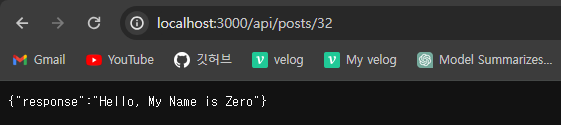
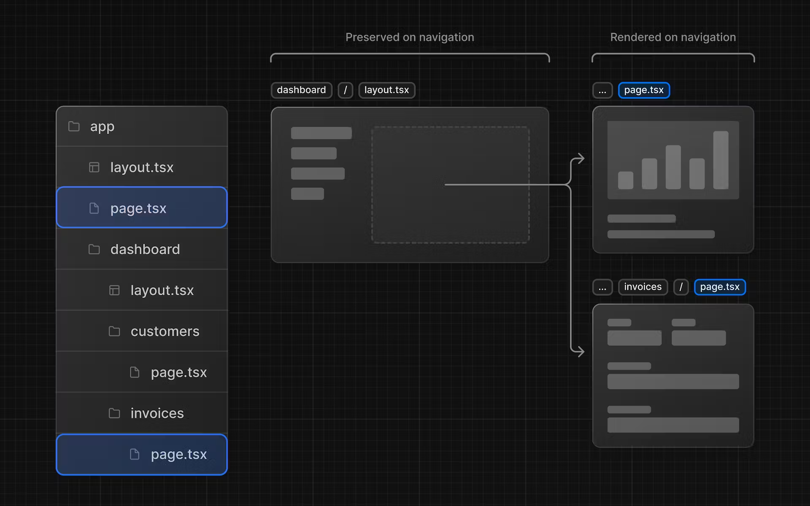

## Next-JS의 파일 컨벤션

### pageRouter와 next13 이후의 appRouter의 차이

1. 기존에는 사용하지 않았던 파일명들이 추가되었습니다. (error, page, not-found, route, layout...)
2. SSR과 SSG를 위한 fetch option이 추가되었습니다. route의 동작방식을 [관리하는 방법이 추가](https://nextjs.org/docs/app/api-reference/file-conventions/route-segment-config)되었습니다.
3. app router로 바뀌면서 지원되지 않는 파일들이 존재합니다.
4. 그 외 기존에 사용하던 방식과 자잘하게 바뀐 방식들이 존재합니다.

> ex: Pages Router에서는 next/router로부터 useRouter를 가져와서 사용했지만, App Router에서는 next/navigation으로부터 useRouter를 가져와야 합니다.

### appRouter에서 지원하는 File Convention

#### layout.js

layout 파일은 라우터들 사이. 해당 폴더의 자식들 사이에서 공유되는 UI를 작성할 수 있습니다.
다음과 같은 특징이 있습니다. 페이지와 같이 `params`는 받을 수 있지만 `searchParams`는 받을 수 없습니다.

`params`로 받을 수 있는 값은 이전과 동일합니다.

**예시**

| route                              | URL       | params                       |
| ---------------------------------- | --------- | ---------------------------- |
| app/shop/[slug]/page.js            | /shop/1   | { slug: '1' }                |
| app/shop/[category]/[item]/page.js | /shop/1/2 | { category: '1', item: '2' } |
| app/shop/[...slug]/page.js         | /shop/1/2 | { slug: ['1', '2'] }         |

```typescript
export default function DashboardLayout({ children }: { children: React.ReactNode }) {
  return <section>{children}</section>;
}
```

루트 레이아웃은 루트 디렉터리의 최상위 파일입니다. Next-12버전에서는 \_app.tsx가 해당 역할을 하였습니다.
여러 루트 레이아웃을 사용하는 경우 해당 루트 레이아웃을 벗어나 다른 루트 레이아웃으로 이동하였을 때 전체를 다시 렌더링 하는 상황이 발생합니다.

```typescript
export default function RootLayout({ children }: { children: React.ReactNode }) {
  return (
    <html lang="en">
      <body>{children}</body>
    </html>
  );
}
```

#### not-found.js

not-found 파일은 없는 페이지를 요청시에 보여지는 패이지로 `notFound()` 함수를 통해 보내지거나 해당 요청된 경로가 세그먼트 상에 없을 때 보낼 수 있습니다.

```typescript
import Link from 'next/link';
import { headers } from 'next/headers';

export default async function NotFound() {
  const headersList = headers();
  const domain = headersList.get('host');
  const data = await getSiteData(domain);
  return (
    <div>
      <h2>Not Found: {data.name}</h2>
      <p>Could not find requested resource</p>
      <p>
        View <Link href="/blog">all posts</Link>
      </p>
    </div>
  );
}
```

#### route.js

route 파일은 사용자 정의 라우트 핸들러로서 다양한 요청에 따라 다양하게 처리를 도와줄 수 있습니다.

> 라우트 핸들러란 특정 URL에 대한 라우트를 정의하고 해당 경로로 들어오는 요청에 대한 응답을 생성해주는 파일을 말합니다.

폴더들과 분리하기 위해 api 폴더에 정리하였습니다. \*app 폴더내에 정의되어 있어야 사용이 가능합니다.

```typescript
/app/aip / post / [postId] / route.js;

import { NextResponse } from 'next/server';

export async function GET(request: Request) {
  return NextResponse.json({ response: 'Hello, my name is Zero' });
}
```

**결과**

<p align="center">
    
</p>

[NextRequest](https://nextjs.org/docs/app/api-reference/functions/next-request) 객체인 request와 정적 매개변수를 context를 이용해서 가져다가 사용할 수 있습니다.

```typescript
app / dashboard / [team] / route.js;

// dashboard/1로 요청을 보낸 경우
export async function GET(request: Request, context: { params }) {
  const team = params.team; // '1'
}
```

[NextResponse](https://nextjs.org/docs/app/api-reference/functions/next-response)등을 활용하여 쿠키, 헤더, 리더렉션등을 쉽게 설정할 수 있습니다.

#### template.js

template 파일은 하위 레이아웃이나 페이지를 래핑, 감싸는 부분에 있어서 레이아웃과 비슷합니다.
하지만 전반에 변경이 되지않고 유지되는 레이아웃과 달리 Template.js는 각 하위 항목에 대해 새 인스턴스를 만들어 냅니다. (자식이 10개의 파일이 있을 경우 해당 코드가 10배로 작성이 됩니다.)

```typescript
export default function Template({ children }: { children: React.ReactNode }) {
  return <div>{children}</div>;
}
```

#### error.js

error 파일은 리액트의 errorBoundary와 같이 예기치 않은 오류가 났을 때 페이지가 멈추는 것을 막고 대체 UI를 표시하는 역할을 해줍니다.

```typescript
'use client'
// Error Component는 client component만 사용이 가능합니다.

import { useEffect } from 'react'

export default function Error({
  error,
  reset,
}: {
  error: Error & { digest?: string }
  reset: () => void
}) {
  useEffect(() => {
    // 에러를 확인할 수 있습니다.
    console.error(error)
  }, [error])

  return (
    <div>
      <h2>Something went wrong!</h2>
      <button
        onClick={
          () => reset()
        }
        { // 오류에 대해 설정된 내용을 초기화를 시킵니다.
          // 또 다시 렌더링을 시도할 수 있고 성공시에 렌더링 된 결과로 대체됩니다.}
      >
        Try again
      </button>
    </div>
  )
}
```

> 만약 페이지를 찾지 못하는 오류가 발생하였을 경우 not-found 페이지 보다 error 페이지가 상위단계의 페이지이기 때문에 error 페이지가 보여지게 됩니다.

#### loading.js

Suspense 기반의 로딩 상태를 보여줄 수 있습니다.

```typescript
export default function Loading() {
  // Or a custom loading skeleton component
  return <p>Loading...</p>;
}
```

#### page.js

page의 경우 세그먼트단위에서 중복되는 파일이 있으면 안됩니다. 최사위 page.js의 경우 최상위 페이지로 그 아래 자식 폴더의 page.js의 경우 부분 렌더링과 같이 들어갈 수 있습니다.

<p align="center">
    
</p>

`params`, `searchParams`등을 이용하여 해당 페이지의 매개변수도 받을 수 있습니다.

```typescript
export default function Page({ params }: { params: { slug: string } }) {
  return <h1>My Page</h1>;
}
```

**예시**

| route                              | URL       | params                       |
| ---------------------------------- | --------- | ---------------------------- |
| app/shop/[slug]/page.js            | /shop/1   | { slug: '1' }                |
| app/shop/[category]/[item]/page.js | /shop/1/2 | { category: '1', item: '2' } |
| app/shop/[...slug]/page.js         | /shop/1/2 | { slug: ['1', '2'] }         |

`searchParams` : 현재 url의 검색 매개변수를 포함하는 객체입니다.

```typescript
export default function Home({
  searchParams,
}: {
  searchParams: { [key: string]: string | string[] | undefined };
}) {
  const pageNumber = searchParams['p'] ?? '1'; // default value is "1"

  return <>Current page is: {pageNumber}</>;
}
```

**예시**

| URL            | searchParams         |
| -------------- | -------------------- |
| /shop?a=1      | { a : ‘1’ }          |
| /shop?a=1&b=2  | { a : ‘1’, b : ‘2’ } |
| /shop?a=17&a=2 | { a : [’1’, ‘2’] }   |

#### 경로 세그먼트을 구성하는 방법

다음에 해당하는 변수를 직접 내보내 [페이지](https://nextjs.org/docs/app/building-your-application/routing/pages-and-layouts), [레이아웃](https://nextjs.org/docs/app/building-your-application/routing/pages-and-layouts) 또는 [경로 핸들러](https://nextjs.org/docs/app/building-your-application/routing/route-handlers)의 동작을 구성할 수 있습니다.

```typescript
export const dynamic = 'auto';
export const dynamicParams = true;
export const revalidate = false;
export const fetchCache = 'auto';
export const runtime = 'nodejs';
export const preferredRegion = 'auto';
export const maxDuration = 5;

export default function MyComponent() {}
```

다음과 같은 옵션들을 설정할 수 있습니다.

`dynamic` : 레이아웃이나 페이지의 동적 동작을 결정 할 수 있습니다.

`dynamicParams` : `generateStaticParams`으로 생성되지 않은 동적 세그먼트를 방문할 때 발생하는 상황을 제어합니다. `false`의 경우 동적 세그먼트의 포함되지 않는 경로로 요청시 404를 반환합니다.

`revalidate` : 레이아웃이나 페이지에 대한 캐싱 시간을 설정합니다.

`fetchCache` : `fetch`의 기본 동작을 재정의를 할 수 있습니다.

#### opengraph-image, twitter-image

사용자가 사이트 링크를 공유할 때 소셜 네트워크 및 메시징 앱에 표시되는 이미지를 설정하는 데 유용합니다.
`next/og`의 `ImageResponse()`를 활용하여 손쉽게 작성할 수 있습니다.

```typescript
import { ImageResponse } from 'next/og';

// Route segment config
export const runtime = 'edge';

// Image metadata
export const alt = 'About Acme';
export const size = {
  width: 1200,
  height: 630,
};

export const contentType = 'image/png';

// Image generation
export default async function Image() {
  // Font
  const interSemiBold = fetch(new URL('./Inter-SemiBold.ttf', import.meta.url)).then((res) =>
    res.arrayBuffer()
  );

  return new ImageResponse(
    (
      // ImageResponse JSX element
      <div
        style={{
          fontSize: 128,
          background: 'white',
          width: '100%',
          height: '100%',
          display: 'flex',
          alignItems: 'center',
          justifyContent: 'center',
        }}
      >
        About Acme
      </div>
    ),
    // ImageResponse options
    {
      // For convenience, we can re-use the exported opengraph-image
      // size config to also set the ImageResponse's width and height.
      ...size,
      fonts: [
        {
          name: 'Inter',
          data: await interSemiBold,
          style: 'normal',
          weight: 400,
        },
      ],
    }
  );
}
```

이 외에도 크롤러를 도와주는 `sitemap.xml`, `robots.txt` 등이 있습니다.

### 참고자료

[[Next JS] Pages Router 에서 App Router 전환기](https://www.timegambit.com/blog/blog-log/app-router#%EC%9D%B4-%EA%B8%80%EC%9D%84-%EC%93%B0%EA%B2%8C-%EB%90%9C-%EA%B3%84%EA%B8%B0)

[공식 문서 - 파일 컨벤션](https://nextjs.org/docs/app/api-reference/file-conventions)

[공식 문서 - 세그먼트 구성](https://nextjs.org/docs/app/api-reference/file-conventions/route-segment-config)
