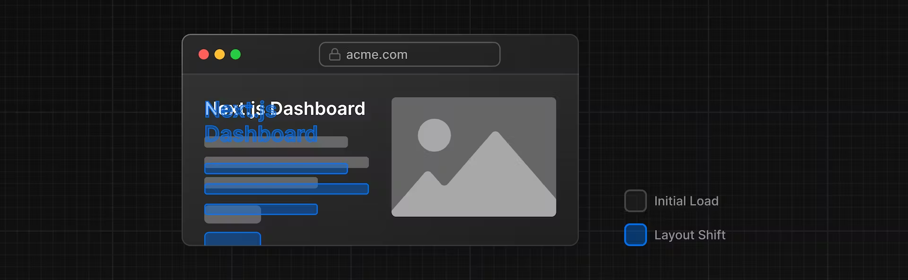

## Next-JS의 폰트와 이미지 최적화 지원

Next-JS에서는 폰트와 이미지를 관리하는데에 있어서 최적화를 지원하고 있습니다.

1. [최적화를 해야하는 이유에 대해서](#최적화를-해야하는-이유에-대해서)
2. [폰트를 최적화 하는 방법](#폰트를-최적화-하는-방법)
3. [이미지를 최적화 하는 방법](#이미지를-최적화-하는-방법)

### 🤔 최적화를 해야하는 이유에 대해서

전통적인 렌더링 방법은 HTML 파일과 CSS 파일을 가져와서 화면에 렌더링되는 방식으로 만들어져 왔습니다. 하지만 아래와 같은 문제가 있었습니다.

<p align="center">
    
</p>

사용자가 보았을 때 먼저 가져와진 이미지때문에 화면이 아래로 밀린다던지. 폰트가 적용이 늦게 돼기 때문에 폰트가 깜빡이면서 UX적으로 불리한 상황이 만들어집니다.

### 폰트를 최적화 하는 방법

이러한 상황을 방지하고자 다운로드한 폰트를 적용을 하는데도 `CSS in JS` 구조가 아닌 `CSS` 파일을 Root 경로에 import를 하는 방법도 있었지만 Next에서는 최적화 방법을 제공을 해줍니다.

Next 프로젝트는 기본적으로 google에서 사용하는 모든 font들을 내장을 하고 있습니다. 때문에 다음과 같이 가져다가 쓰면 됩니다.

```typescript
/app/iu / fonts.ts;

import { Inter } from 'next/font/google';

export const inter = Inter({ subsets: ['latin'] });
```

또한 다양한 [옵션](https://nextjs.org/docs/app/api-reference/components/font#font-function-arguments)들을 사용할 수 있습니다.

해당 옵션들 중 `preload` 라는 옵션을 사용하여 미리 로드를 하고 있습니다.

```typescript
/app/iu / fonts.ts;

import { Inter } from 'next/font/google';

export const inter = Inter({
  src: [
    { path: './inter/Inter-Thin.ttf', weight: '100' },
    { path: './inter/Inter-Regular.ttf', weight: '400' },
    { path: './inter/Inter-Bold-Italic.ttf', weight: '700', style: 'italic' },
  ],
});
```

만약 프로젝트에서 모든 곳에서 해당 폰트를 사용하게 하고싶다면 다음과 같이 최상위 경로에 연결하면 됩니다.

```typescript
/app/alotuy.tsx;

import '@/app/ui/global.css';
import { inter } from '@/app/ui/font';

export default function RootLayout({ children }: { children: React.ReactNode }) {
  return (
    <html lang="en">
      <body className={inter.className}>{children}</body>
    </html>
  );
}
```

### 이미지를 최적화 하는 방법

위에서 보았듯이 우리는 이미지가 렌더링 됨으로서 UI가 변경이 되어 사용자의 UX를 해치는 것을 고려를 하여 코드를 작성해야 합니다.

따라서 다음과 같은 상황들을 생각을 해야합니다.

- 이미지가 로드될 때 레이아웃이 바뀌는 것을 방지해야합니다.
- 다양한 장치에 대한 이미지 크기를 지정해야합니다.
- 이미지가 다양한 화면 크기에 반응하는지 확인해야합니다.

이미지 최적화는 그 자체로 전문 분야로 간주될 수 있는 웹 개발의 큰 주제입니다. 이러한 최적화를 수동으로 구현하는 대신 `next/image` 구성 요소 `<Image/>`를 사용하여 이미지를 자동으로 최적화할 수 있습니다.

`<Image>` 태그는 `` 의 확장 버전이며 다음과 같은 자동 이미지 최적화 기능을 제공합니다.

1. 이미지가 로드될 때 자동으로 레이아웃 이동을 방지합니다.

2. 뷰포트가 더 작은 장치에 큰 이미지가 전달되는 것을 방지하기 위해 이미지 크기를 조정합니다.

3. 기본적으로 이미지가 지연 로딩됩니다.(이미지가 사용자의 시점에 보여질 때 로드가 됩니다.)

4. WebP 와 같은 최신 형식으로 이미지를 제공합니다.

```typescript
import Image from 'next/image';

<Image
  src="/hero-desktop.png"
  width={1000}
  height={760}
  alt="Screenshots of the dashboard project showing desktop version"
/>;
```

다음과 같은 값들은 `<Image/>` 태그를 구성하는데 있어서 필수 요소들입니다.

`src` : `` 태그와 같습니다. 이미지의 경로를 알려줍니다. `public` 내의 파일의 경우 `/` 부터 경로를 지정하여 가져올 수 있습니다.

`alt` : `` 태그와 같습니다. 이미지가 없을 시에 보여지는 글이며 보통 해당 이미지를 설명해주는 글을 작성합니다.

`width & height` : 각각의 이미지의 가로, 세로 길이를 나타내며 이미지가 로드가 되지 않았음에도 미리 구역을 잡아두기 위해서 필수로 입력을 해두어야 합니다.

> 이미지의 크기가 자연스럽게 보여지기 위해 `width & height`의 경우 원본 그림의 크기의 배율과 똑같이 유지하면 좋습니다.
