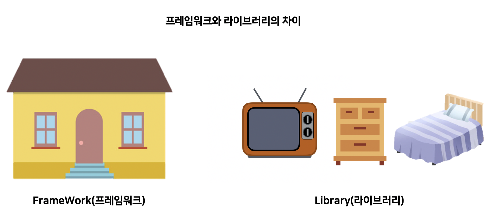
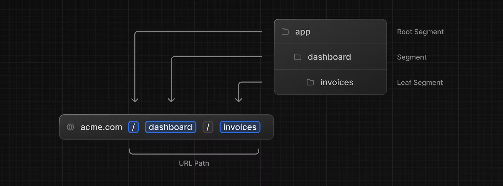
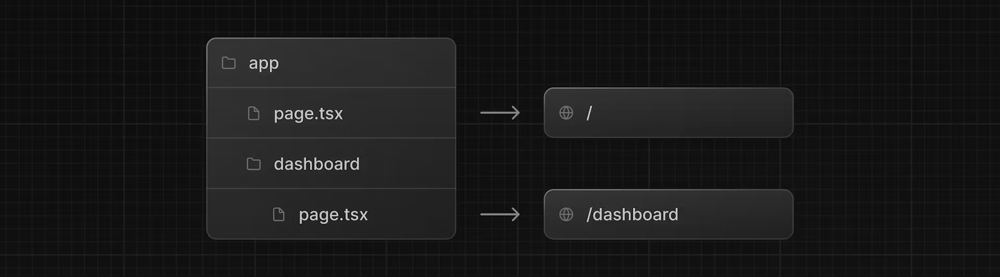
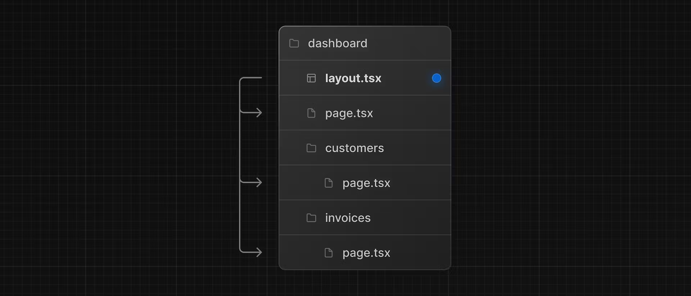

## Next-JS의 라우트시스템

### 목차

1. [Next-JS는 프레임 워크](#Next-JS는-프레임-워크)
2. [파일 기반 라우팅 시스템](#파일-기반-라우팅-시스템)
3. [URL 매개변수에 접근하는 방법](#URL-매개변수에-접근하는-방법)

### Next-JS는 프레임 워크

Next-JS의 [공식 홈페이지](https://nextjs.org/)에 가면 다음과 같은 문구가 있습니다.

> The React Framework for the Web

웹을 위한 리액트 프레임워크이다. 라우트시스템을 알기 전 Framework에 대해 알고가면 좋을 것 같아 작성하게 되었습니다.

<p align="center">
    
</p>

웹을 만들 때의 라이브러리와 프레임워크를 생각해보면 웹이라는 거주 공간을 만들 때 라이브러리를 사용하면 침대, 옷장, 티비와 같이 가구와 소품들과 지붕, 벽까지도 개발자들이 하나하나 골라서 만들 수 있게 해줍니다.

vue를 하려다가 react를 할 수도 있고 angular를 할 수도 있습니다.

하지만 프레임워크는 다릅니다. 정해진 틀이 있고 해당 공간에서 만들 수 있게 해줍니다. 백엔드에서는 유명한 것으로 [Spring](https://spring.io/) 정도가 있습니다.

프레임워크의 장점으로는 생각할게 많이 필요가 없다는 것입니다. 라이브러리만으로 웹을 만들 때에는 가구들도 골라야하고 지붕과 벽까지도 골랐어야 했습니다. 하지만 프레임워크는 위에 사진과 같이 건물이 만들어져 있습니다. 이곳에서 개발자들은 안에 가구 정도만 골라서 넣으면 웹을 만들 수 있습니다.

하지만 단점도 존재합니다. 바로 정해진 규칙을 따라야 한다는 것입니다. 문이 정문에 있는 것이 안좋아서 옆쪽에 달고 싶다. 창문을 하나 더 달고 싶다. 이런 미리 만들어져있는 부분에 한해서는 개발자들의 발언이 통하지 않습니다. 이미 만들어져 있는 것들을 사용해야 합니다.

때문에 Next.js의 라우트 시스템도 마찬가지입니다. 이미 만들어져 있기에 개발자들은 😕알겠습니다. 😥사용하겠습니다. 하면 되는겁니다.

### 파일 기반 라우팅 시스템

Next.js에서의 라우트 시스템은 파일 기반 라우팅을 이해해야 합니다.

<p align="center">
    
</p>

Next.js는 폴더가 중첩된 경로를 만드는 데 사용되는 파일 시스템 라우팅을 사용합니다. 각 폴더는 URL과 세그먼트에 매핑되는 경로 세그먼트를 나타냅니다.

<p align="center">
    
</p>

다음과 같이 `/app` 폴더의 최상위에 있는 page의 경우 `/` url에 매핑이 되어있고 `/app/dashboard`의 경우 `/dashboard`로 매핑이 되어져 있습니다. 이처럼 폴더의 이름으로 경로가 나눠지고 `page.*` 파일이 해당 경로의 페이지가 됩니다.

<p align="center">
    
</p>

위 사진의 경우 각각 `/dashboard/customers`, `/dashboard/invoices`로 매핑이 된다는 것을 알아야 합니다.

<p align="center">
    
</p>

또한 각각의 페이지는 `/dashboard`의 속해있으므로 부분 렌더링이 됩니다.

### URL 매개변수에 접근하는 방법

라우팅을 어떻게 하는지 알았으니 이제 매개변수에 접근하는 방법도 궁금할텐데요 다음과 같이 가져와서 사용할 수 있습니다.

#### Client

Client Component에서는 다양한 훅들을 제공하고 있습니다.

`useSearchParams()` : 현재 URL의 매개변수에 액세스할 수 있습니다.예를 들어, `/dashboard/invoices?page=1&query=pending` 이 URL에 대한 검색 매개변수는 다음과 같습니다. `{page: '1', query: 'pending'}`

```typescript
'use client';

import { useSearchParams } from 'next/navigation';

export default function Home() {
  const searchParams = useSearchParams();

  const pageNumber = searchParams.get('p') ?? '1'; // default value is "1"

  return <>Current Page is : {pageNumber}</>;
}
```

`usePathname()` : 현재 URL의 경로명을 읽을 수 있습니다. 예를 들어 `/dashboard/invoicesuse` 경로의 경우 `Pathname '/dashboard/invoices'`을 반환합니다

#### Server

Server에서 만들어져서 오는 페이지의 경우 어떻게 가져와야할지 고민이 될 수 있습니다. 기본적으로 제공하는 props를 통해서 가져올 수도 있습니다.

```typescript
export default function Page({ params }: { params: { slug: string } }) {
  return <h1>My Page</h1>;
}
```

**예시**

| route                              | URL       | params                       |
| ---------------------------------- | --------- | ---------------------------- |
| app/shop/[slug]/page.js            | /shop/1   | { slug: '1' }                |
| app/shop/[category]/[item]/page.js | /shop/1/2 | { category: '1', item: '2' } |
| app/shop/[...slug]/page.js         | /shop/1/2 | { slug: ['1', '2'] }         |

`searchParams` : 현재 url의 검색 매개변수를 포함하는 객체입니다.

```typescript
export default function Home({
  searchParams,
}: {
  searchParams: { [key: string]: string | string[] | undefined };
}) {
  const pageNumber = searchParams['p'] ?? '1'; // default value is "1"

  return <>Current page is: {pageNumber}</>;
}
```

**예시**

| URL            | searchParams         |
| -------------- | -------------------- |
| /shop?a=1      | { a : ‘1’ }          |
| /shop?a=1&b=2  | { a : ‘1’, b : ‘2’ } |
| /shop?a=17&a=2 | { a : [’1’, ‘2’] }   |
