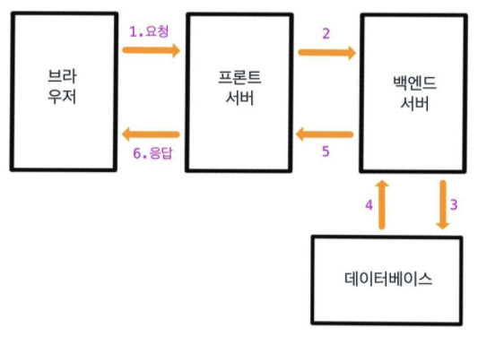
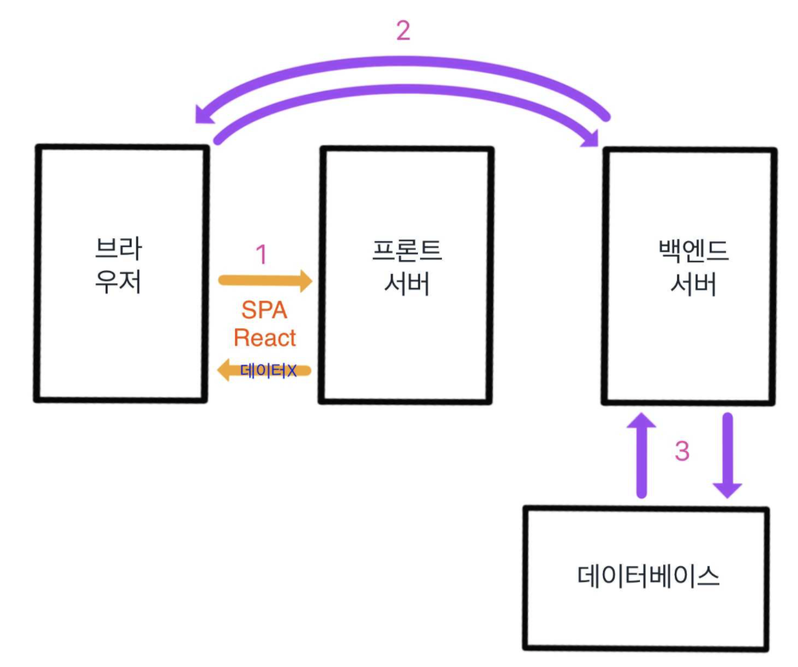

## SSR과 CSR의 차이를 이해하고 정리하기

### 목차

1. [SSR에 대한 정리](#SSR)
2. [CSR에 대한 정리](#CSR)
3. [SSR과 CSR 비교하기](#SSR과-CSR-비교하기)

## SSR

    

### SSR (Server Side Rendering)이란?

SSR이란 서버에서 해당 사이트를 만드는 데 필요한 HTML을 전부 만들어 준상태가 아닌 각각의 도메인 주소를 렌더링을 해주는 것으로 전통적인 웹 페이지가 만들어지는 과정이라고 할 수 있습니다.

여기서 말하는 전통적인 웹 페이지, SSR의 처리과정이란 다음과 같습니다.

1. 사용자가 특정 URL을 입력하거나 클릭하여 웹 사이트에 접속합니다.
2. 웹 브라우저는 DNS를 통해 도메인 이름을 해당하는 IP 주소로 변환하고, 프론트엔드 서버가 백엔드 서버에 HTTP 요청을 전송합니다.
3. 서버는 받은 HTTP 요청을 처리하고, 필요한 응답 값(HTML, CSS)을 찾아서 클라이언트에게 전송합니다.
4. 필요한 경우 서버는 동적으로 웹 페이지를 생성하기 위해 데이터를 검색합니다.
   서버는 정적 파일(HTML, CSS 등)을 포함한 응답을 브라우저에게 전달합니다.
5. 브라우저는 받은 HTML과 CSS를 이용하여 웹 페이지의 뼈대를 그리고 렌더링합니다. 이후 JS를 이용하여 이벤트 바인딩을 해줌으로서 페이지의 이벤트를 주어 생동감 있는 페이지로 만들 수 있습니다.

## CSR

    

### CSR (Client Side Rendering)이란?

CSR이란 서버에서 해당 사이트를 만드는 것이 아닌 Client에서 만드는 방식입니다. 페이지를 만드는데 필요한 파일들을 모두 한 번에 받은 후에 이후 Client에서 렌더링하는 방식입니다.

CSR의 과정은 다음과 같습니다.

1. 사용자가 특정 URL을 입력하거나 클릭하여 웹 사이트에 접속합니다.
2. 웹 브라우저는 DNS를 통해 도메인 이름을 해당하는 IP 주소로 변환하고, 서버에 HTTP 요청을 전송합니다.
3. 서버는 받은 HTTP 요청을 처리하고, 필요한 파일들(HTML, CSS, JavaScript 등)을 클라이언트에 응답으로 전송합니다.
4. 브라우저는 받은 파일들을 다운로드하고, HTML을 파싱하여 DOM을 생성하고 CSS를 적용하여 페이지를 렌더링합니다.
5. JavaScript가 포함된 경우, 브라우저는 해당 스크립트를 다운로드하고 실행하여 동적인 기능을 추가하고 이벤트를 처리합니다.

## SSR과-CSR-비교하기

<table>
    <tr>
        <th>
        비교
        </th>
        <th>
        SSR
        </th>
        <th>
        CSR
        </th>   
    </tr>
    <tr>
        <td>초기 렌더링 속도</td>
        <td>순간 필요한 페이지만 다운로드 받기 때문에 상대적으로 빠르다.</td>
        <td>모든 페이지를 다운로드 받기 때문에 상대적으로 느립니다</td>
    </tr>
    <tr>
        <td>자연스러운 화면전환</td>
        <td>모든 페이지를 url이 이동이 되었을 때마다 다운로드를 받기때문에 상대적으로 부드럽게 이동하지 못하게 화면이 껌뻑인다.</td>
        <td>처음에 페이지를 전부 다운로드를 하였으면 보여주기만 하면 되기 때문에 앱과 같이 자연스러운 화면 전환이 가능합니다.</td>
    </tr>
    <tr>
        <td>네트워크의 영향</td>
        <td>매번 다운로드 받기 때문에 네트워크가 느릴 경우 매번 빈 화면이 오래 출력이 될 수 있다.</td>
        <td>처음에만 다운로드를 받기 때문에 네트워크가 느릴 경우 처음에만 빈 화면이 오래 출력이 될 수 있다.</td>
    </tr>
    <tr>
        <td>검색 엔진 최적화</td>
        <td>html으로 구현이 되어있기 때문에 검색 엔진에 의해 노출될 가능성이 높아집니다.</td>
        <td>html은 빈파일, js로 구현이 되어있기 때문에 검색 엔진에 노출이 될 가능성이 적습니다.</td>
    </tr>
    <tr>
        <td>서버의 비용</td>
        <td>매 호출시마다 렌더링을 해서 보내주기 때문에 상대적으로 서버가 할 일이 많고 비용이 많이 듭니다.</td>
        <td>렌더링 과정을 안하고 뿌려줄 html 파일만 전송하면 되기때문에 상대적으로 비용이 적게듭니다.</td>
    </tr>
</table>

