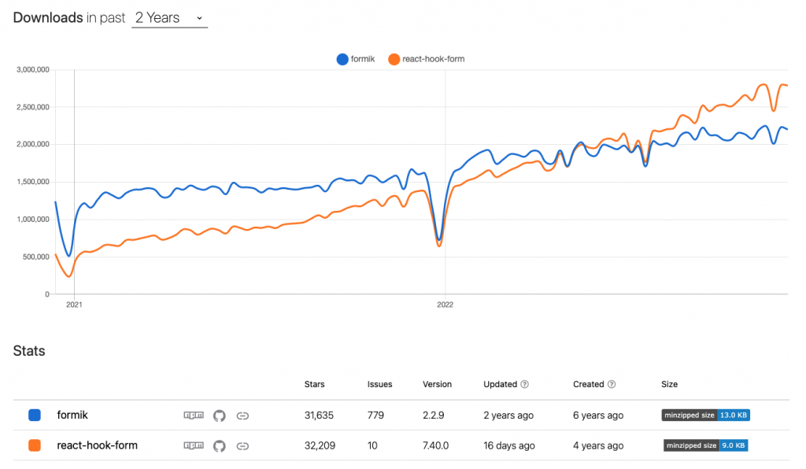

## React Hook Form

React에서 복잡한 폼을 만들때, 간결하고 쉬운 코드작성을 도와주는 라이브러리

```jsx
const useInputs = (initialValue, booleanValue) => {
  const [values, setValues] = useState(initialValue);
  const [isFull, setIsFull] = useState(booleanValue);
  const onChange = (event) => {
    setValues((prev) => ({
      ...prev,
      [event.target.name]: [event.target.value],
    }));
  };

  useEffect(() => {
    let issFull = true;
    Object.values(values).forEach((v) =>
      v[0] === undefined || v[0].length === 0 ? (issFull = false) : ''
    );
    setIsFull(issFull);
  }, [...Object.values(values)]);

  const checkEmailAndPassword = (email, password) => {
    const reqExp =
      /^[0-9a-zA-Z]([-_\.]?[0-9a-zA-Z])*@[0-9a-zA-Z]([-_\.]?[0-9a-zA-Z])*\.[a-zA-Z]{2,3}$/;
    if (!reqExp.test(email)) {
      alert('이메일 양식이 맞지 않습니다.');
      return;
    }
    if (password.length < 8) {
      alert('비밀번호는 8자리 이상이어야 합니다.');
      return;
    }
  };

  return [values, onChange, isFull, checkEmailAndPassword, setValues];
};
```

기존의 리액트에서 만들때는 입력된 데이터들의 값들을 가져와야 하고 에러 상태, 유효성 검사의 결과 값을 나타낼 state 상태를 따로 지정을 해주어야만 합니다.

```jsx
const [inputs, setInputs] = useState({
 input1:"",
 input2:"",
 ...
 input9:"",
 input10:"",
}
```

```jsx
const [isTrue, setIsTrue] = useState(false);

useEffect(() => {
  if (value.password === value.confirmPassword) {
    setIsTrue(true);
  } else {
    setIsTrue(false);
  }
}, [value]);
```

요구사항이 하나 생길때마다 하나하나 state를 선언해주고, 해당 state를 다루기 위해서 또 핸들링 함수를 만들어야하고… 모든 유효성 검증을 하기 위해서는 코드가 더더욱 길어질 것입니다.

또한 모든 값이 state로 연결되어 있으므로 하나의 값이 변할때 마다 무수히 많은 리렌더링이 발생합니다. 이처럼 불필요한 렌더링으로 불필요한 연산, 처리비용이 발생할 수 있습니다.

이처럼 복잡한 유효성 검사, 상태관리를 도와주고 간결하게 사용하기 위해 나온 라이브러리가 react-hook-form 입니다.



formilk라는 라이브러리도 있지만 react-hook-from 보다 인기가 적습니다.

**장점**

- 불필요한 리렌더링 방지
  - input에 변화가 있을때 form의 모든 요소가 리렌더링 되는 것이 아닌 입력받고 있는 input 요소만 리렌더링 합니다.
- 빠른 component mounting 속도

## react-hook-form 설치 방법

```jsx
$ npm i react-hook-form
# or
$ yarn add react-hook-form
```

## react-hook-form 사용 방법

```jsx
import { useForm } from 'react-hook-form';

export default function App() {
  const { register, handleSubmit } = useForm();
}
const onSubmit = (data) => console.log(data);

<form onSubmit={handleSubmit(onSubmit)}>
  {/* register your input into the hook by invoking the "register" function */}
  <input defaultValue="test" {...register('example')} />

  {/* include validation with required or other standard HTML validation rules */}
  <input {...register('exampleRequired', { required: true })} />
  {/* errors will return when field validation fails  */}
  {errors.exampleRequired && <span>This field is required</span>}

  <input type="submit" />
</form>;
```

### 등록하는 방법 (register)

기본적으로 구성요소를 (register를 통해) 연결을 해서 사용을 합니다. 이렇게 하면 유효성 검사, 제출 모두에 해당 값을 사용할 수 있습니다.

```jsx
const { register, handleSubmit, formState: { errors } } = useForm({
			  resolver: zodResolver(signUpSchema),
			  mode: 'onBlur',
			});

<input {...register("firstName"}/>
// input 태그내의 직접 register를 연결을 하는 방법
// name="username"
// value = { username };
// onChange = { onChange };
// 대신 ...register를 적어줍니다.

const {onChange, onBlur, name, ref} = register("firstName");

<input onChange={onChange} onBlur={onBlur} name={name} ref={ref} />
// firstName이라는 이름의 값을 지닌 태그 하나만 만드는 방법
```

기본적으로 react-hook-form 라이브러리를 이용을 할때에는 기본적으로 register를 이용하여 input 태그내의 useRef 때와 같이 직접적으로 연결을 해주어야 사용을 할 수 있습니다.

위코드에서 아래 예시를 보면 전달받은 아래 ref={ref}를 통해서 데이터를 가져오는 것을 볼 수 있습니다. 이는 ref.current.value를 통해서 가져오는 것처럼 값이 변해도 불필요한 렌더링을 요구하지 않는것을 볼 수 있습니다.

```jsx
- onChange : 변했을 경우 이벤트를 줄 수 있습니다.
- onBlur : 벗어났을 경우 이벤트를 줄 수 있습니다.
- ref : 참조를 등록할 수 있습니다.
- name : 이름을 등록할 수 있습니다.
```

### Event를 활용한 실시간 유효성 검사를 하는 방법

리액트 훅 폼을 사용하다보면 클릭 버튼을 누르기전 유효성 검사가 필요할 때가 있습니다. 예를 들어 회원가입을 한다하는 경우 실시간으로 password 이름의 input과 confirmPassword 이름의 input 태그내의 value 값들이 서로 일치해야 하는지 실시간으로 비교를 해야할 때가 있습니다. 이러한 경우 submit 이벤트가 일어나지 않아도 검사를 할 수 있게 mode를 설정할 수 있습니다.

```jsx
-onChange - onBlur - onSubmit - onTouched - all;

// example
const {
  register,
  handleSubmit,
  formState: { errors },
} = useForm({ mode: 'onBlur' });

// register에 연결된 input 태그에서 Blur 이벤트가 일어났을 경우 유효성 검사를 진행합니다.
```

### Submit Event가 일어났을 경우 데이터를 전송하는 방법

error사항이 없다면 handleSubmit을 통해 데이터를 보낼 수 있습니다. 만약 에러가 나올경우 보내지는 요청이 취소되고 자동으로 포커싱하게 됩니다.

```jsx
const { register, handleSubmit } = useForm();

const submitData = (data) => {
  console.log('이메일 주소', data);
};

<LoginForm onSubmit={handleSubmit(submitData)} action="">
  <LoginInput type="text" {...register('email')} placeholder="이메일" />
  <SubmitBtn>회원가입</SubmitBtn>
</LoginForm>;
```

handleSubmit의 인자로는 onValid, onInvalid 2개의 인자를 줄 수 있습니다.

onValid는 성공시에 실행될 함수를, onInvalid는 해당 submit이 실패할 경우 실행될 함수를 적으면 됩니다.

```jsx
const onValid = (data: LoginForm) => {
  console.log('성공');
  console.log(data);
};
const onInvalid = (errors: FieldErrors) => {
  console.log('실패');
  console.log(errors);
  resetField('password');
  // 만약 해당 field를 비워주고 싶으면 resetField 함수를 이용하면 reset 할 수도 있습니다.
};
```

### 유효성 검사를 위해 조건들을 부여하는 방법

register내에서 조건을 부여할 수 있습니다.

register 내에서 작성하는 경우 value는 조건을 의미하고 message는 해당 조건이 만족하지 못할시 ‘false’일 경우 errors.[name]?.message로 나타나게 할 수 있습니다.

validation조건 같은경우 모두 HTML 표준을 기반으로 하며 사용자 지정 validation도 허용합니다. 이에 yup이나 zod 같은 라이브러리를 통해 조건을 주기도 합니다.

```jsx
const {
  register,
  handleSubmit,
  formState: { errors },
} = useForm();
```

- required : 해당 값이 공백이면 안됩니다.

  ```jsx
  <input {...register("test", { required: true })} />

  <input {...register("test", { required: { value: true, message: "this is required"}})} />
  ```

- min : 최소 숫자를 정할 수 있습니다.
  ```jsx
  <input {...register('test', { min: { value: 5, message: '최소 숫자가 5가 되지 않습니다' } })} />
  ```
- max : 최대 숫자를 정할 수 있습니다.
- minLength : 최소 길이를 정할 수 있습니다.
- maxLength : 최대 길이를 정할 수 있습니다.
- pattern : 패턴(유효성) 검사를 할 수 있습니다.
- validate : 직접 validate 함수를 만들어 validation을 할 수 있습니다.
  ```jsx
  <input
    {...register("test", {
      validate: value => value === '1' || 'error message'
     }}}/>
  	{errors.test && <span>{erros.test?.message}</span>
  <input
    {...register("test1", {
      validate: {
        positive: v => parseInt(v) > 0 || 'should be greater than 0',
        lessThanTen: v => parseInt(v) < 10 || 'should be lower than 10',
        validateNumber: (_: number, formValues: FormValues) => {
          return formValues.number1 + formValues.number2 === 3 || 'Check sum number';
        },
        checkUrl: async () => await fetch() || 'error message',
        messages: v => !v && ['test', 'test2']
      }
    })}}
  />
  	{errors.test && <span>{erros.test?.message}</span>
  ```
- valueAsNumber : 해당 값이 숫자인지 확인 할 수 있습니다.
- valueAsDate : 해당 값이 날짜형식인지 확인 할 수 있습니다.
- setValueAs : 입력받은 값의 타입을 변환할 수 있습니다.
- disabled : 해당 값의 오류를 없애고 에러상태를 true로 바꿔줄 수 있습니다.

## 라이브러리를 사용하여 직접 `validation` 을 적용해주는 방법

validation에 기재되는 로직은 일반 자바스크립트의 유효성 로직과 큰 차이가 없습니다.

그럼 validation을 써야하는 이유는 무엇일까요?

```jsx
<input {...register("test", { required: { value: true, message: "this is required"}})} />

<input {...register("test", { min : { value : 5, message : "최소 숫자가 5가 되지 않습니다"} })} />
```

위에서 썻던 코드들을 가지고 왔습니다. input 태그내에서 직접 유효성 검사를 하기위한 조건을 줄 수 있습니다.

해당 조건에 맞는 value 값을 만족하지 못한다면 errors message로 뒤에 문자열이 들어가게 됩니다.

만약 input이 여러개가 들어가는 회원가입 창의 경우 하나하나 조건을 다 주고 이제 error.message 까지 설정을 하게되면 코드를 읽는데에 있어서 불편함을 줄 수 있습니다.

또한 email같은 로직을 검사할 때마다 직접적으로 ‘@’ 골뱅이가 들어가는지 ‘.’이 들어가는지 직접 검사를 하거나 아니면 휴대폰 번호가 정상적으로 입력이 되었는지.. 유효성 검사를 하기위해서 사용자들은 직접 정규표현식을 작성해야하는 불편함을 줄 수 있습니다.

이러한 경우 조건을 미리 한곳에 다 저장해두고 전달만하면 가독성이 쉽게 될 것이고 전보다 수정을 하는데에 있어서 찾기도 쉬울 수 있습니다.

react-hook-form에 가장 잘어울리는 양식 유효성 검사 라이브러리로서 yup과 zod가 있습니다.

zod는 TypeScript를 지원을 해주고 다양한 기능들이 계속해서 많이 나오면서 인기많은 라이브러리로 사용이 되고 있습니다.

```jsx
const schema = yup.object().shape({
  email: yup
    .string()
    .required('이메일은 필수 입력 항목입니다')
    .email('이메일 형식에 맞지 않습니다.'),
  password: yup
    .string()
    .required('비밀번호는 반드시 필요합니다.')
    .min(8, '최소 글자수 미달입니다.')
    .max(20, '최대 글자수 초과입니다.'),
  passwordConfirmation: yup
    .string()
    .oneOf([yup.ref('password'), null], '비밀번호가 일치하지 않습니다.')
    .required(true, '비밀번호를 한번 더 입력해주세요'),
});

const {
  register,
  handleSubmit,
  formState: { errors },
} = useForm({
  resolver: yupResolver(schema),
  mode: 'onBlur',
});
```

```jsx
const schema = zod
  .object({
    email: zod.string().nonempty('이메일 반드시 필요합니다.').email('이메일 형식에 맞지 않습니다.'),
    password: zod
      .string()
      .nonempty('비밀번호는 반드시 필요합니다.')
      .min(8, '최소 글자수 미달입니다.')
      .max(20, '최대 글자수 초과입니다.'),
    confirmPassword: zod.string().nonempty('비밀번호를 한번 더 입력해주세요.'),
  })
  .refine((data) => data.password === data.confirmPassword, {
    message: '비밀번호가 일치하지 않습니다.',
    path: ['confirmPassword'],
  });

const {
  register,
  handleSubmit,
  formState: { errors },
} = useForm({
  resolver: zodResolver(schema),
  mode: 'onBlur',
});
```
