## 스토리북이란?

각종 라우팅과 State로 연결이 되어있는 리액트 view를 독립된 환경에서 돌아가고 테스트 할 수 있게 해주는 UI 개발환경, 테스팅 툴입니다.

**키워드**

`Normalize` 표준화

`Modulariztion` 모듈화

`lsolated` 독립성

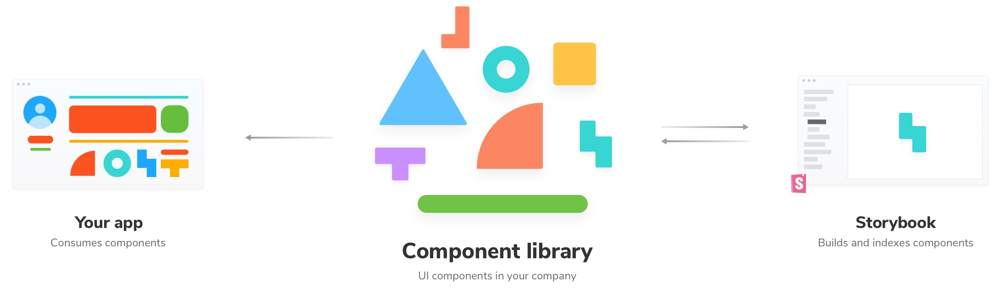

컴포넌트를 목록화하여 보고 싶은 컴포넌트를 언제든 확인 가능하도록 만들어줍니다.

Mock 상태를 통하여 각종 상태 값에 따라 바로바로 디자인이 변경되는 것을 확인할 수 있고, 각 개체별 혹은 각 페이지 별로 여러가지 컴포넌트들을 묶어서 변화를 확인할 수 있습니다.

이를 통하여 개발팀이 아닌 다른 기획, 디자인 팀과도 같이 협업을 하여 확인이 가능합니다.

여러 케이스를 미리 테스트를 할 수 있고 수정이 필요할 경우 빠르게 변경된 내용을 반영하여 작업을 수월하게 진행할 수 있습니다.

로그인이 되었을 때 보여지는 페이지들과 로그인이 안되었을 때 보여지는 페이지가 있습니다. 우리는 해당 페이지를 보기 위해서는 매번 이전 페이지에서 직접 로그인을 통해서 해당 페이지의 상태를 주거나 하드 코딩을 통해서 페이지의 디자인을 확인 할 수 있습니다.

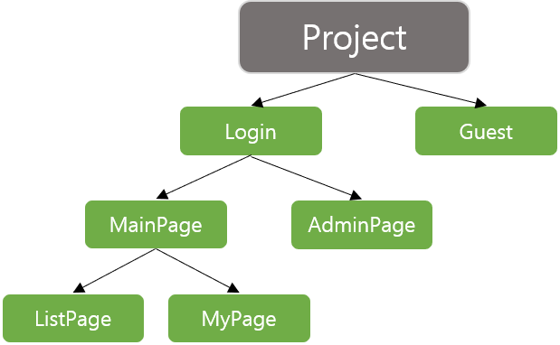

하지만 스토리북은 다릅니다. 스토리북은 모든 페이지를 선형적인 구조로 관리를 합니다.

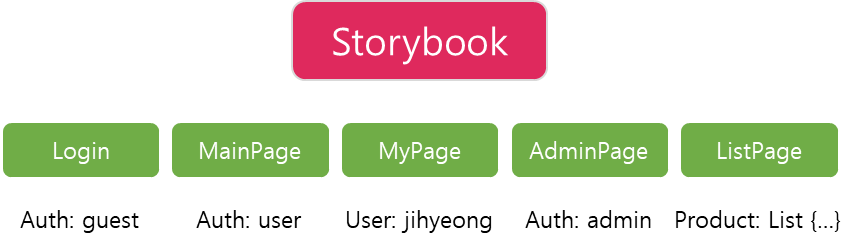

해당 페이지에서 필요한 state 상태값이 없어도 Mock State를 통해서 State에 따라 렌더링 되는 화면들을 확인할 수 있습니다. 또한 연관되어있는 페이지들을 하나의 Story로 묶어 각 State에 따라 필요한 케이스들을 나열 할 수도 있습니다. (ex: 데이터가 있는 경우, 없는 경우, 로딩중인 경우)

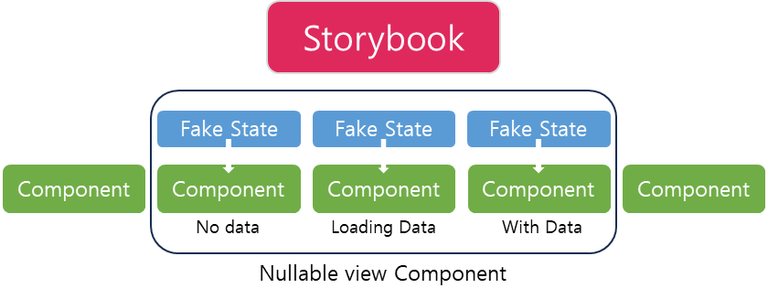

컴포넌트들을 페이지 별로 묶어서 렌더링을 해줄 수 있습니다.. 각 스토리는 각 페이지가 되고 그 안에 여러가지 컴포넌트들이 있을 수 있습니다.


로그인이 되는 그 과정을 하나의 Story 자체에 단계를 가지게 할 수도 있습니다.

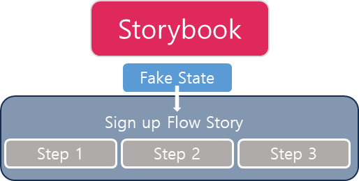

Story book에 Story?

Story란 Element들을 return 하는 Function

일정한 부분을 떼어서 원하는 부분만큼 스토리를 만들어 줄 수 있습니다.

프로젝트를 진행하는 사용자에 따라서 다르게 만들어질 수 있습니다.

### 1. 설치

`npx storybook@latest init`

### 2. 실행

`npm run storybook`

### 스토리북에서 기본적으로 제공하는 addons

1. actions : 이벤트가 일어날 때 마다 로그를 찍어줍니다.
2. links : 스토리에서 다른 스토리로 일어날 때 사용을 합니다.
3. knobs : state를 타이핑해서 동적으로 사용을 해줍니다.
4. console : 콘솔을 찍어줍니다.
5. notes : 해당 컴포넌트에서 다른 사용자에게 보여줄때 메모를 남길 수 있습니다.

**에드온 추가방법**

`npm i —save @storybook/addon-backgrounds`

```jsx
// addons.js
imporrt '@storybook/addon-backgrounds/register'
```

```jsx
// config.js
soriesOf('someComponent', moudle)
  .addDecorator(
    backgrounds([
      { name: 'twiter', value: '#00aced', default: true },
      { name: 'facebook', value: '#3b5998' },
    ])
  )
  .add('component', () => <Component>Click me</Component>);
```

Decorators addons

컴포넌트에서 스타일 적용하는 방법

```jsx
const styles = {
  textAlign: 'center',
};

const CenterDecorator = (storyFn) => <div style={styles}>{storyFn()}</div>;

storiesOf('Button', module)
  .addDecorator(CenterDecorator)
  .add('with text', () => <Button onClick={action('clicked')}>Hello Button</Button>)
  .add('with some emojies', () => <Button onClick={action('clicked')}>🚀🐕💩🪀🍭</Button>);
```

개발자 이외에 직군들도 볼 수 있게 손쉽게 사용이 가능하게 할 수 있습니다.

npm script에 추가

```jsx
// package.json

{
	"scripts" : {
		"storybook" : "bulid-storybook -c .storybook -o .out"
	}
}
```

실행 방법

`npm run storybook`

## 사용 방법

1. 폴더 살펴보기

   기본적인 세팅은 라이브러리를 설치할 때 전부 깔려있습니다.

   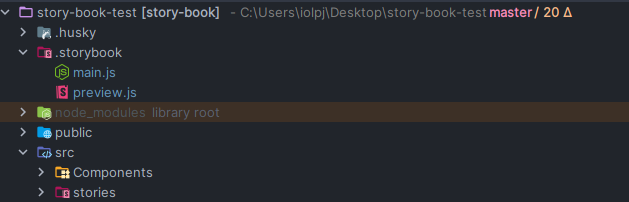

   기본 구조를 살펴보자면 .storybook에는 기본 설정 파일이 있습니다.

   `main.js` 에는 confing 파일을 관리할 수 있고 이곳에서 addon들을 추가할 수 있습니다.

   ```jsx
   const path = require('path');
   // storybook을 위한 config설정들
   module.exports = {
     // stories 파일이 어디에 있는지 경로 설정
     stories: ['../stories/**/*.stories.mdx', '../stories/**/*.stories.@(js|jsx|ts|tsx)'],
     // addons 세팅 , 유니버스엔 하얀 컴포넌트들이 많아서 다크모드를 적용시켜줌
     addons: [
       '@storybook/addon-links',
       '@storybook/addon-essentials',
       'storybook-addon-styled-component-theme/dist/preset',
       'storybook-dark-mode',
     ],
     webpackFinal: async (config) => {
       // node_mules폴더와 styles 폴더 안의 모듈을 인식할 수 있게 함
       config.resolve.modules = [path.resolve(__dirname, '..'), 'node_modules', 'styles'];

       // 절대 경로 설정
       config.resolve.alias = {
         ...config.resolve.alias,
         '@components': path.resolve(__dirname, '../components'),
         '@assets': path.resolve(__dirname, '../public/assets'),
       };

       return config;
     },
   };
   ```

   • `.storybook/preview.js` 모든 story들에 글로벌하게 적용될 포맷 세팅이 있습니다.

   ```jsx
   // 모든 stort들에 글로벌하게 적용될 포맷을 세팅

   // npx sb init을 통해 세팅된 값
   // controls - 개발자가 코드를 수정하지 않아도 storybook에서 동적으로 인터렉션 가능하도록 .
   export const parameters = {
     // Global 하게 argType에 on 으로 시작하는 이벤트 핸들러 함수들을 모두 허용하는 정규식을 적어주면, Action 탭에서 이벤트가 발생하는 것을 감지할 수 있음
     actions: { argTypesRegex: '^on[A-Z].*' },
     // 해당 데이터타입을 가진 속성을 만났을 때 정규표현식을 통해 데이터타입에 따라 storybook은 이들을 적절하게 테스팅할 수 있도록 매칭해줄 것.
     controls: {
       matchers: {
         color: /(background|color)$/i,
         date: /Date$/,
       },
     },
   };

   // 글로벌 스타일 적용시키고 싶다면 여기서 적용시켜줄 수 있음 (추후 decorator같은 것들)
   ```

   storybook에는 storybook 라이브러리를 통해 UI들을 테스트를 할 수 있는 환경들을 제공하는 페이지를 제공해줍니다.

   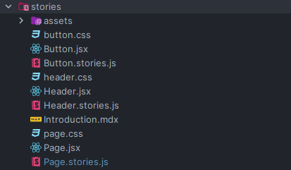

   assets 폴더에는 아이콘들이 들어있고 `Button.jsx`, `Header.jsx`, `Page.jsx` 등과 같은 예제 파일이 있습니다.

   <aside>
   💡 전달받은 props를 통해서 css 속성을 관리 할 수도 있습니다. 하지만 예제와 같이 css 파일을 분리하는게 좋은지 생각해보면 좋을 것 같습니다.

   </aside>

2. **예제 파일을 통한 JSX파일 작성 방법**

   기본적으로 한 component `.jsx`, `.stories.js`, `.css` 세가지 형식의 파일을 만듭니다.

   `.css` 파일을 추가를 안할수도 있습니다.

   각 컴포넌트 폴더안에 `.jsx` 파일과 `.stories.js` 파일을 넣습니다.

   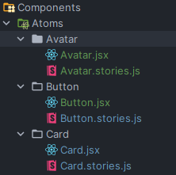

   `.jsx` 작성 방식입니다.

   기존의 컴포넌트를 작성하고 컴포넌트안에 들어가야하는 props의 타입을 지정을 해줄 수 있습니다.

   props 타입을 주는 방법은 PropTypes에서 검사하는 방식과 동일합니다.

   예제에서는 className을 지정을 해줌으로서 css 파일에서 스타일을 읽어옵니다. 이방법과 다르게 Mui 라이브리나 Styled-Components를 사용을 하여도 문제가 없습니다.

   [PropTypes와 함께 하는 타입 검사 – React](https://ko.legacy.reactjs.org/docs/typechecking-with-proptypes.html)

   ```jsx
   // Button.jsx

   import PropTypes from 'prop-types'; // PropsTypes를 통해서 타입 검사를 해줍니다.
   import './button.css';
   /**
    * Primary UI component for user interaction
    */
   export const Button = ({ primary, backgroundColor, size, label, ...props }) => {
     const mode = primary ? 'storybook-button--primary' : 'storybook-button--secondary';
     return (
       <button
         type="button"
         className={['storybook-button', `storybook-button--${size}`, mode].join(' ')}
         style={backgroundColor && { backgroundColor }}
         {...props}
       >
         {label}
       </button>
     );
   };

   Button.propTypes = {
     /**
      * Is this the principal call to action on the page?
      */
     primary: PropTypes.bool, // true or false 둘 중 하나를 선택해야 합니다.
     /**
      * What background color to use
      */
     backgroundColor: PropTypes.string, // 문자열을 입력해야합니다.
     /**
      * How large should the button be?
      */
     size: PropTypes.oneOf(['small', 'medium', 'large']),
     // 여러가지 중 하나를 선택하게 합니다.
     /**
      * Button contents
      */
     label: PropTypes.string.isRequired, // 문자열을 입력해야합니다. *반드시
     /**
      * Optional click handler
      */
     onClick: PropTypes.func, // onClick 이라는 함수를 정의 하였습니다.
   };

   Button.defaultProps = {
     // 해당 컴포넌트의 default 값으로 정해졌습니다.
     backgroundColor: null,
     primary: false,
     size: 'medium',
     onClick: undefined,
   };
   ```

   `.stories.js` 작성 방식입니다.

   기본 꼴

   ```jsx
   // 어떤 이름으로 스토리북에 올릴 것인지, 어떤 설정으로 렌더링할지 정의
   export default {
   	title: 스토리북에 올릴 component폴더 계층 구조,
   	component: 스토리를 만들 컴포넌트 이름
   }

   export const 스토리이름 = () => 해당스토리에서 테스트할 인자가 담긴 컴포넌트
   ```

   코드 예시

   ```jsx
   import { Button } from './Button';

   export default {
     title: 'Example/Button',
     component: Button,
     tags: ['autodocs'], // docs 문서를 어떻게 보여줄지 결정합니다. *autodocs
     argTypes: {
       backgroundColor: { control: 'color' },
   		// backgroundColor 를 color값을 선택할 수 있도록 추가 설정을 해줍니다.
     },
   };

   <!-- 이곳부터는 스토리 입니다 -->

   export const Primary = {
     args: {
       primary: true,
       label: 'Button',
     },
   };

   export const Secondary = {
     args: {
       label: 'Button',
     },
   };

   export const Large = {
     args: {
       size: 'large',
       label: 'Button',
     },
   };

   export const Small = {
     args: {
       size: 'small',
       label: 'Button',
     },
   };
   ```

   argTypes 설정

   [ArgTypes](https://storybook.js.org/docs/react/api/arg-types)

   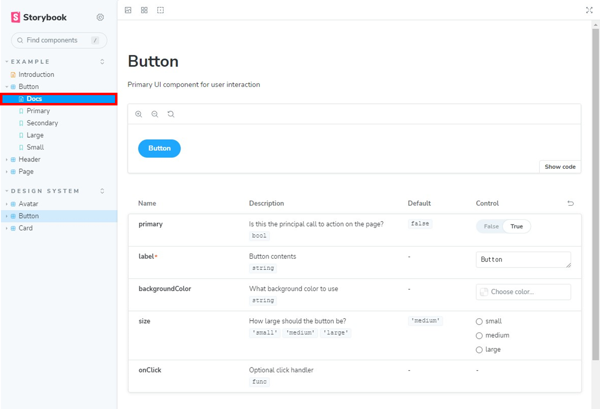

   Storybookpage의 모습입니다. 위의 빨간 박스안에 있는 Docs 문서가 Button JSX 파일이 자동으로 문서화가 된것입니다. 해당 파일의 Props로 뭐가 들어올 수 있는지 선택이 가능합니다.

   Control에 의해 들어온 prop에 대해서 바로 변경이 된 것을 보여줍니다.

   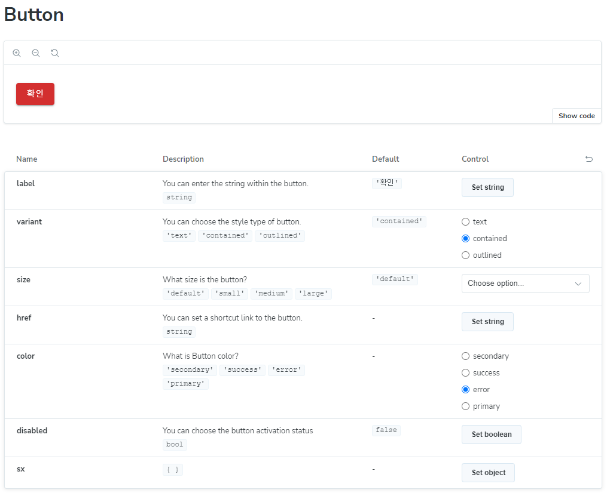

   Mui 라이브러리를 이용한 스타일 적용하기

   StoryBook에서 Story에 대해서 생각을 해볼 필요가 있습니다. 여기서 스토리란 Props나 상태를 임의로 부여를 해줌으로서 해당 페이지의 변화를 감지를 하거나 보여줄 수 있는 것을 얘기합니다.

   ```jsx
   export const Primary = {
     args: {
       primary: true,
       label: 'Button',
     },
   };

   export const Secondary = {
     args: {
       label: 'Button',
     },
   };

   export const Large = {
     args: {
       size: 'large',
       label: 'Button',
     },
   };

   export const Small = {
     args: {
       size: 'small',
       label: 'Button',
     },
   };
   ```

   위의 코드에서 Story부분만 추출을 하였습니다. 해당 Story는 해당 Button 컴포넌트를 각 상황에 맞는 Props를 주었을 때의 컴포넌트로 보여줍니다.

   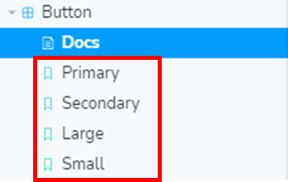

   웹 페이지내에서의 스토리 위치

   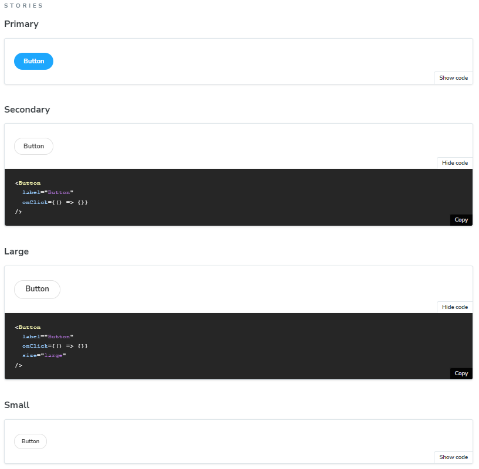

   각 컴포넌트의 상태나 코드를 확인 할 수 있습니다.

   `.css` 파일은 기존의 작성과 동일하므로 생략하겠습니다.

   스토리북의 장점

   1. Component를 웹과 독립된 환경에서 개발 할 수 있습니다.
   2. webpack과 addon을 통해 storybook과 interactive한 개발이 가능합니다
   3. 컴포넌트 별 라이브러리화 해서 브라우징 가능합니다.
   4. 깔끔한 / 모듈화된 view의 강제성 - clen 코드와 재사용성 증가합니다.
   5. 쉽고 빠른 deploy와 협업이 가능합니다.

   Story book을 이용해서 프로젝트를 만드는 방법

   1. 화면 흐름도를 정의하고 디자인을 만듭니다.
   2. 앱을 설계하기전에 먼저 스토리를 만듭니다.
   3. 1단계에서 정의한 부분을 스토리를 통해서 검토, 수정을 해봅니다.
   4. 지속가능한 수정을 통해 앱을 만듭니다.

   ### 스토리안에 Style을 추가하는 방법

   ThemeProvider를 통해 감싸줄 수 있다.

   ```jsx
   //preview.js
   import React from 'react';
   import { ThemeProvider } from 'styled-components';
   const theme = {
     margin: '10px',
   };

   export const decorators = [
     (Story) => (
       <ThemeProvider theme={theme}>
         <Story />
       </ThemeProvider>
     ),
   ];
   ```

   ### gitgub action으로 배포 설정하는 방법

   > 제작한 UI컴포넌트들을 스토리북을 통해 문서화해 공유하기에 좋은 방법이다. 디자이너 입장에서는 내가 열심히 디자인한 컴포넌트들이 잘 구현되고 있는지 감시할 수 있다!! github Action을 이용해 push 액션이 오면 자동으로 깃허브 페이지에 배포를 하려고 한다. **[배포 링크](https://bankidz.github.io/bankidz-client/)**

   `npm i @storybook/storybook-deployer --save-dev`

   > package.json에 가서 scripts에 `deploy-storybook": "storybook-to-ghpages"` 를 추가해준다.

   ```yaml
   name: Build & Deploy Storybook
   on:
     push:
       branches: [dev]
       paths: ['src/components/**']
   jobs:
     build-and-deploy:
       runs-on: ubuntu-latest
       steps:
         - uses: actions/checkout@v2
         - name: Install and Build 🔧
           # This needs an Acces Token stored as "GH_TOKEN" 👇
           run: |
             npm install
             npm run deploy-storybook -- --ci
           env:
             GH_TOKEN: ${{ secrets.GH_TOKEN }}
   ```

   > 깃허브 워크플로우 디렉토리에 .yml 파일을 하나 만들어준다.

   > dev 브랜치에 push가 오고(&&), 'src/components' 디렉토리에 변경사항이 있을 때 액션이 실행된다.

   > 처음 스토리북을 설치하면 자동으로 생기는 예제 파일들 중에 .mdx 파일이 들어있는데, 이 때문에 배포 중에 에러가 났다. 로컬에선 문제없이 빌드가 되는데 깃허브 액션을 통해 빌드할때만 문제가 생겼다. **@mdx-js/react** 를 설치해주고 다시 push를 날려보니 빌드가 정상적으로 되는것을 확인했다.

   참고자료

   [고티켓-react 컴포넌트 라이브러리 만들기(1)-storybook](https://devnm.tistory.com/4)

   [[React] Storybook 설정 및 Github Actions 배포 자동화](https://9yujin.tistory.com/46)

   [스토리북 제대로 활용하기](https://velog.io/@devstone/스토리북-제대로-활용하기)

   [Storybook이 뭐죠?](https://youtu.be/XIMON_SEge0)

   [[10회-1]Say Hello to Storybook: 스토리북을 통한 React UI 컴포넌트 개발](https://youtu.be/jc9xKzdkYDg)
