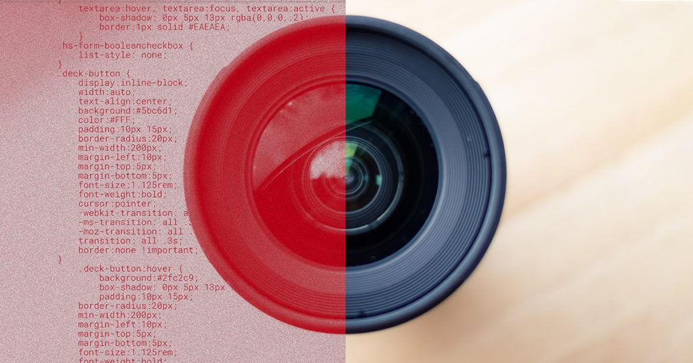
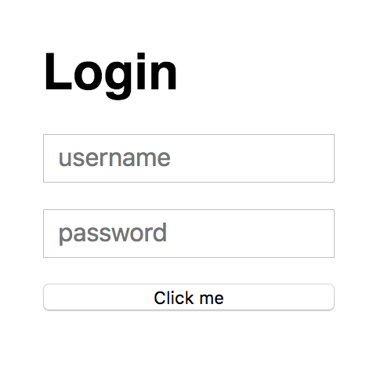
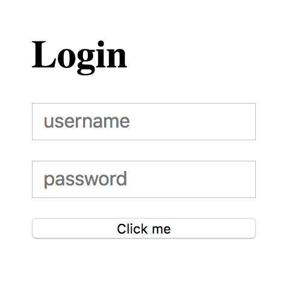
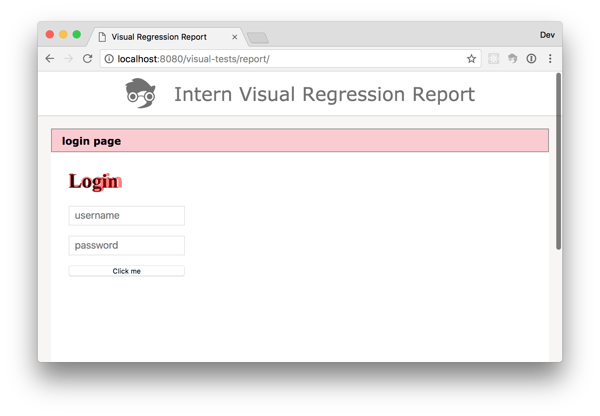
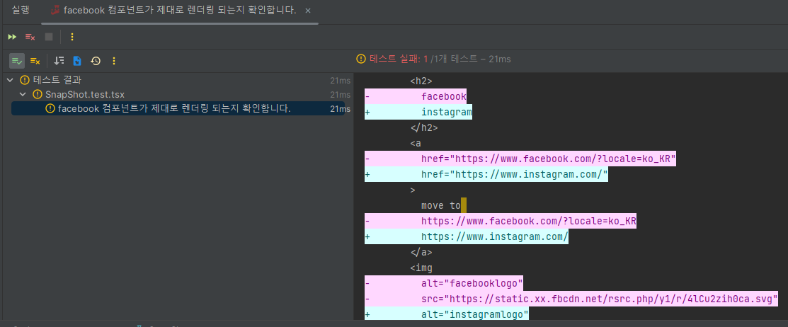
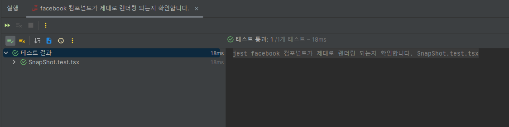

## SnapShot Testing

### SnapShot Testing이란?

<p align="center">
     
</p>

기존의 테스트 코트들이 렌더링을 예상해서 만들었다면 SnapShot Testing은 "출력 비교" 테스트라고도 불립니다. 왜냐하면 해당 테스트는 미리 생각하고 만드는 것이 아닌 사전에 만들어져있는 코드들로 만들어진 페이지 또는 컴포넌트와 새롭게 짜여진, 변경된 코드로 만들어진 결과물이 같은지 확인합니다.

<p align="center">
    
    
</p>

위 사진과 같이 두 컴포넌트는 다른 것을 알 수 있습니다. 만약 첫번째 사진에서 SnapShot으로 사진을 찍어두었다면 두번째에서는 테스트가 실패하게 됩니다.

<p align="center">
    
</p>

즉 이처럼 Ui가 달라져서 실패를 찾아내는 경우가 있는가 하면 코드의 속성이 달라져서 실패가 나는 경우도 있습니다.

### SnapShot 구현하기

아래 컴포넌트로 직접 구현을 해봅니다.

```typescript
const SnapShot = ({ img_url, link_url, title }: PropsType) => {
  return (
    <>
      <h2>{title}</h2>
      <a href={link_url}>move to {link_url}</a>
      
    </>
  );
};

export default SnapShot;
```

테스트 코드를 작성을 해줍니다.

```typescript
test('facebook 컴포넌트가 제대로 렌더링 되는지 확인합니다.', () => {
  const components = render(
    <SnapShot
      img_url={'https://static.xx.fbcdn.net/rsrc.php/y1/r/4lCu2zih0ca.svg'}
      link_url={'https://www.facebook.com/?locale=ko_KR'}
      title={'facebook'}
    />
  );

  expect(components).toMatchSnapshot();
});
```

처음 실행하였을 경우 아래와 같이 html 코드들로 형태가 보이는 .snap 확장자의 파일이 보여집니다.

```snap
// Jest Snapshot v1, https://goo.gl/fbAQLP

exports[`facebook 컴포넌트가 제대로 렌더링 되는지 확인합니다. 1`] = `
{
    <div>
      <h2>
        facebook
      </h2>
      <a href="https://www.facebook.com/?locale=ko_KR">
        move to
        https://www.facebook.com/?locale=ko_KR
      </a>
      
    </div>
  </body>,
  "container": <div>
    <h2>facebook</h2>
    <a href="https://www.facebook.com/?locale=ko_KR">
      move to
      https://www.facebook.com/?locale=ko_KR
    </a>
    
  </div>,
  ...
  "
}
`;

```

만약 두번째로 실행 할 때 아래와 같이 코드를 변경한다고 해보겠습니다.

```typescript
test('facebook 컴포넌트가 제대로 렌더링 되는지 확인합니다.', () => {
  const components = render(
    <SnapShot
      img_url={
        'https://www.instagram.com/images/instagram/xig/homepage/screenshots/screenshot2.png?__d=www'
      }
      link_url={'https://www.instagram.com/'}
      title={'instagram'}
    />
  );

  expect(components).toMatchSnapshot();
});
```

아래와 같이 에러가 나는 것을 확인 할 수 있습니다.

<p align="center">
    
</p>

왜냐하면 기존에 처음으로 실행된 코드를 통해 해당 파일을 저장을 해두었고 이후 바뀐 props를 통해서 두 번째로 시도를 할 경우 처음과 다르기 때문에 에러가 나는 것입니다.

때문에 저장된 원래 코드로 변경을 하면 에러가 사라집니다.

<p align="center">
    
</p>

SnapShot 테스트는 호불호가 많습니다. UI는 개발을 하면 계속 변하게 되어있습니다. 과연 변하지 않는 컴포넌트를 위한 정적인 테스트를 할 필요가 있을까?

자주 바뀌는 Ui 같은 경우 비대칭 매처를 통해 처리를 할 수 있습니다.

```typescript
expect(userData).toMatchSnapshot({
  createdAt: expect.any(Date),
  id: expect.any(Number),
});
```

SnapShot Testing의 장점

1. 빠른 변경 감지 - 코드를 이전 값과 비교를 하고 의도치않게 변화된 부분을 빠르게 파악을 할 수 있습니다.
2. 초기 버그 탐지 - 코드의 변경사항을 통해 초기에 버그를 감지하는데 도움이 됩니다.

SnapShot Testing의 단점

1. 불필요한 파일 및 코드 증가 - 파일마다 스냅샷을 저장을 하면 개발을 하면서 불필요한 코드, 파일량이 늘어나게 됩니다.
2. UI 변경시 업데이트의 번거로움 - UI가 변경이 될 떄마다 개발자가 매번 업데이트 해주어야 하는 것을 귀찮은 일 입니다.
3. 높은 의존성의 어려움 - 너무 많은 의존성이 있는 경우 사용이 힘들수도 있습니다.
4. TDD와의 불일치 - 미리 만들어져 있는 코드를 기준으로 변경이 안되게 하는거기 때문에. 테스트 주도개발인 TDD에 맞지않다.

물론 불필요한 스냅샷을 제거하기 위해 정기적인 리팩토링이나 저장하는 부분을 최소화 할수도 있습니다. 그런데도 SnapShot Testing은 필요할지 의문입니다. 하지만 프로젝트의 규모가 커질수록 개발을 하면서 발생하는 side-effect나 변경사항을 보다 쉽게 찾을 수 있도록 도와줍니다.

참고자료

- [Snapshot Testing: Benefits and Drawbacks](https://www.sitepen.com/blog/snapshot-testing-benefits-and-drawbacks)
- [[번역] 리액트 스냅샷 테스팅의 단점들](https://velog.io/@k7120792/%EB%B2%88%EC%97%AD-%EB%A6%AC%EC%95%A1%ED%8A%B8-%EC%8A%A4%EB%83%85%EC%83%B7-%ED%85%8C%EC%8A%A4%ED%8C%85%EC%9D%98-%EB%8B%A8%EC%A0%90%EB%93%A4-o8jypesqnr#ui%EB%8A%94-%EC%A0%95%EC%A0%81%EC%9D%B4%EC%A7%80-%EC%95%8A%EB%8B%A4)
