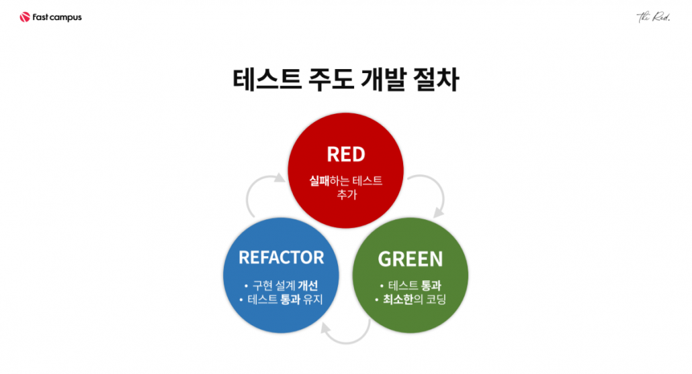
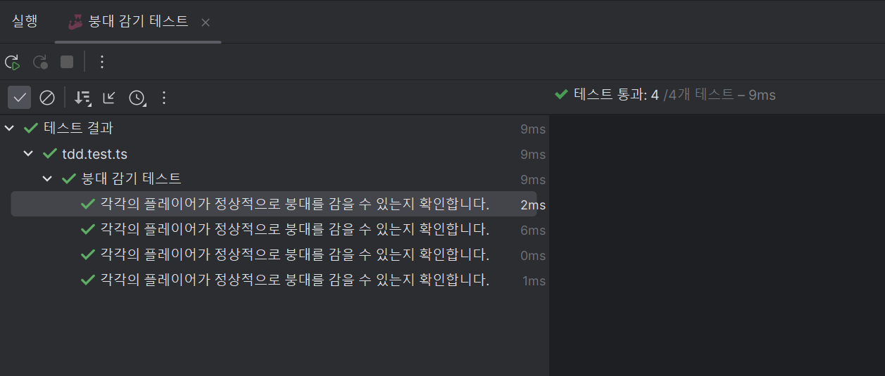

## TDD (Test-Driven Development)

<p align='center'>
    
</p>

### 테스트 주도 개발이란?

먼저 구현해야할 기능들을 정리하고 이후 테스트를 통과하는 설계를 한 뒤 리팩토링을 통해 개선해 나가면서 테스트 통과를 유지해나가는 것을 의미합니다.

설계를 하기전에 먼저 구현해야할 함수등을 작성을 해두는 것입니다. 코딩테스트라고 생각하면 됩니다.

[[PCCP 기출문제] 1번 / 붕대 감기](https://school.programmers.co.kr/learn/courses/30/lessons/250137)를 이용하여 설계해보도록 하겠습니다.

### 테스트 주도 개발의 과정

1. 실패하는 테스트 코드를 작성합니다.
    ```typescript
    describe("붕대 감기 테스트", () => {
        // given
        const cases = [
            {
                bandage: [5, 1, 5],
                health: 30,
                attaks: [[2, 10], [9, 15], [10, 5], [11, 5]],
                expected: 5
            },
            {
                bandage: [3, 2, 7],
                health: 20,
                attaks: [[1, 15], [5, 16], [8, 6]],
                expected: -1
            },
            {
                bandage: [4, 2, 7],
                health: 20,
                attaks: [[1, 15], [5, 16], [8, 6]],
                expected: -1
            },
            {
                bandage: [1, 1, 1],
                health: 5,
                attaks: [[1, 2], [3, 2]],
                expected: 3

            }
        ];

        test.each(cases)("각각의 플레이어가 정상적으로 붕대를 감을 수 있는지 확인합니다.",
            ({bandage, health, attaks, expected}) => {

            // when
            const result = solution(bandage, health, attaks)

            // result
            expect(result).toBe(expected);
        })
    });
    ```

2. 해당 함수(기능)을 최소단위로 구현합니다.

    지금은 아예 `solution()`이라는 함수가 선언조차 되어있지 않기에 당연히 ERROR가 발생합니다. 따라서 개발자는 해당 테스트가 실행이 될 수 있도록 `solutuon()`을 구현하면 되는 것입니다.

    ```typescript
    function solution(bandage: number[], health: number, attacks: number[][]) {
        const second = attacks[attacks.length - 1][0];
        let 현재체력 = health;
        let 연속성공 = 0;
        let life = true;
        Array.from({length: second + 1}).forEach((_, index) => {
            const 공격 = attacks.find((value) => value[0] === index);
            if (공격 !== undefined) {
                연속성공 = 0;
                현재체력 -= 공격[1];
                if (현재체력 <= 0)
                    life = false
            } else {
                let 체력증가량 = bandage[1];
                연속성공 += 1;
                if (연속성공 === bandage[0]) {
                    체력증가량 += bandage[2];
                    연속성공 = 0;
                }
                현재체력 = Math.min(health, 현재체력 + 체력증가량);
            }
        });
        return life ? 현재체력 : -1;
    }
    ```

    일단 로직을 대충 구현을 해두었기 때문에 성공하는 결과를 가져옵니다.

    <p align="center">
        
    </p>

    하지만 로직을 보면 개선해야할 부분들이 많이 있는 것을 알 수 있습니다.

3. 마지막으로 구현 설계를 개선하면서 코드를 리팩토링합니다.
    
    불필요한 변수를 없애고 한글을 영어로 변경합니다. 또한 특정 조건에 해당할 시 함수를 먼저 종료하는 방식으로 리팩토링을 진행합니다.

    ```typescript
    function solution(bandage: number[], initialHealth: number, attacks: number[][]) {
        const lastSecond = attacks[attacks.length - 1][0];
        let currentHealth = initialHealth;
        let consecutiveSuccess = 0;

        for (let second = 0; second <= lastSecond; second++) {
            const attack = attacks.find((value) => value[0] === second);

            if (attack) {
                consecutiveSuccess = 0;
                currentHealth -= attack[1];

                if (currentHealth <= 0) {
                    return -1; // 생존 불가능한 경우, -1을 즉시 반환
                }
            } else {
                let healingAmount = bandage[1];
                consecutiveSuccess += 1;

                if (consecutiveSuccess === bandage[0]) {
                    healingAmount += bandage[2];
                    consecutiveSuccess = 0;
                }

                currentHealth = Math.min(initialHealth, currentHealth + healingAmount);
            }
        }

        return currentHealth;
    }
    ```
    조금 더 빨라진 테스트시간과 가독성 좋은 코드를 볼 수 있습니다.

    <p align="center">
        
    </p>

### TDD 정리

이처럼 TDD는 실패하는 테스트 코드를 작성한 다음 해당 코드를 성공하게끔 만드는 방식으로 개발을 진행합니다. 또한 input, output을 정해두고 로직을 생각하다보니 코드를 짤 때 훨씬 수월하고, 테스트에 성공한 사례가 있기 때문에 리팩토링을 통해 코드 품질도 쉽게 높일 수 있습니다.